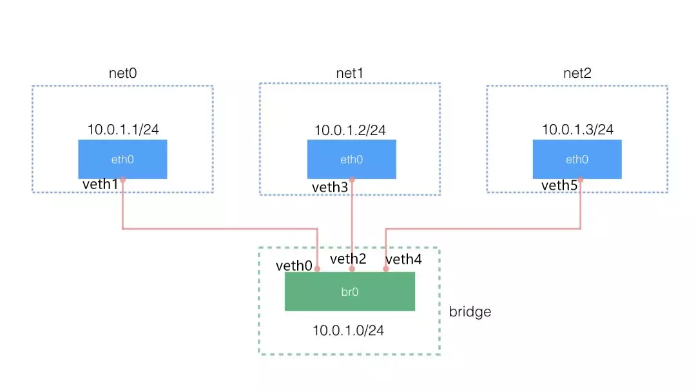
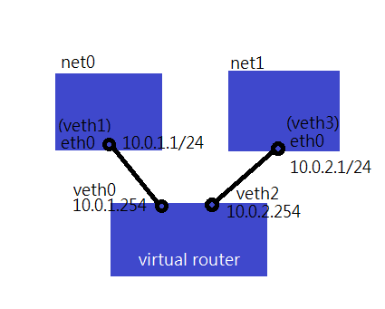
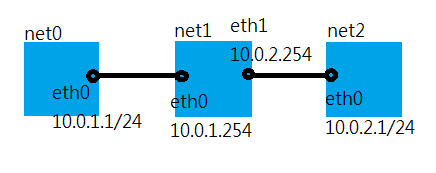
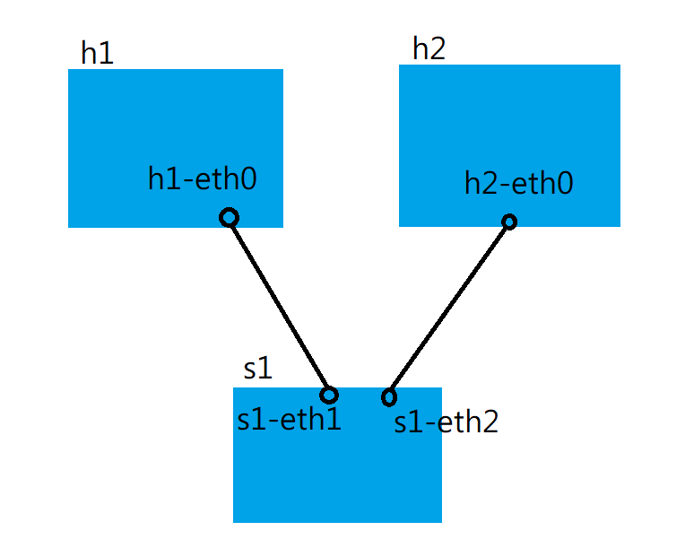
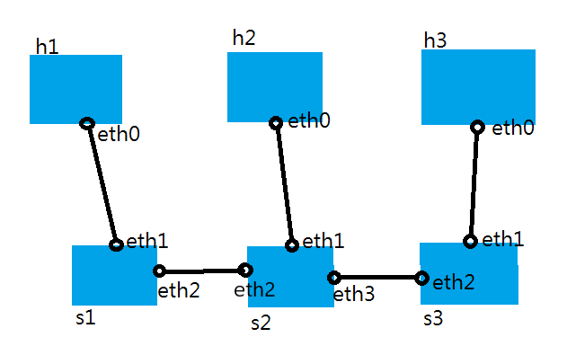
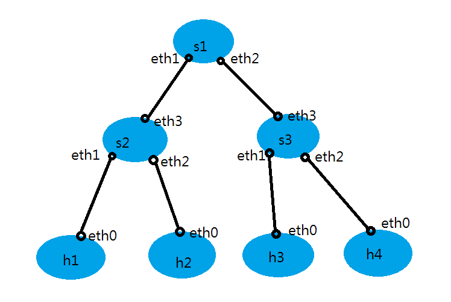

# 0221 第二週筆記

## network namespace 創造不同機器互相通訊
* 相關指令
```
# ip netns add net1  #增加命名空間
# ip netns exec net1 +指令  #在命名空間執行指令
# ip link add type veth  #建立虛擬網路卡(Virtual Ethernet)，一對的網路卡
# ip link set veth0 netns net0  #將網路卡新增到命名空間中
```
### 範例1

1. 在root端建立一個bridge
```
# apt install bridge-utils  #安裝bridge相關套件
# ip link add br0 type bridge  #創建一個br0的bridge
# ip link set dev br0 up  #啟動br0
# brctl show  #查看bridge狀態
```
2. 建立三對veth
```
# ip link add type veth
# ip link add type veth
# ip link add type veth
```
3. 創造三個空間
```
# ip netns add net0
# ip netns add net1
# ip netns add net2
# ip netns ls  #查看建立的空間
```
4. 將網路卡放到命名空間中，並配置IP
```
# ip link set dev veth1 netns net0  #把veth1放入net0中
# ip netns exec net0 ip link set dev veth1 name eth0  #將veth1網路卡名稱重設為eth0
# ip netns exec net0 ip addr add 10.0.1.1/24 dev eth0  #配置IP
# ip netns exec net0 ip link set dev eth0 up  #啟動
# ip netns exec net0 ip addr show  #查看更改後的網路卡名稱及IP狀態

# ip link set dev veth3 netns net1  #把veth3放入net1中
# ip netns exec net1 ip link set dev veth3 name eth0  #將veth3網路卡名稱重設為eth0
# ip netns exec net1 ip addr add 10.0.1.2/24 dev eth0  #配置IP
# ip netns exec net1 ip link set dev eth0 up  #啟動
# ip netns exec net1 ip addr show  #查看更改後的網路卡名稱及IP狀態

# ip link set dev veth5 netns net2  #把veth5放入net2中
# ip netns exec net2 ip link set dev veth5 name eth0  #將veth5網路卡名稱重設為eth0
# ip netns exec net2 ip addr add 10.0.1.3/24 dev eth0  #配置IP
# ip netns exec net2 ip link set dev eth0 up  #啟動
# ip netns exec net2 ip addr show  #查看更改後的網路卡名稱及IP狀態
```
5. 將veth0 veth2 veth4掛載到bridge上
```
# ip link set dev veth0 master br0
# ip link set dev veth2 master br0
# ip link set dev veth4 master br0
# brctl show  #檢查是否掛載成功
# ip link set dev veth0 up
# ip link set dev veth2 up
# ip link set dev veth4 up
# ifconfig  #檢查狀態
# ip netns exec net0 ping 10.0.1.2 -c 3  #測試能不能互相通訊
# ip netns exec net0 ping 10.0.1.3 -c 3  #測試能不能互相通訊
```
6. 不關機狀態下刪除所有配置
```
# brctl delif br0 veth0
# brctl delif br0 veth2
# brctl delif br0 veth4
# brctl show
# ip link delete veth0
# ip link delete veth2
# ip link delete veth4
# ifconfig br0 down
# brctl delbr br0 
# ifconfig
# ip netns del net0
# ip netns del net1
# ip netns del net2
# ip netns ls
```
### 範例2-模擬不同網域如何透過vrouter傳輸資料

1. 確認是否有開啟路由功能
```
# echo 1 > /proc/sys/net/ipv4/ip_forward  #開啟路由
# echo 0 > /proc/sys/net/ipv4/ip_forward  #關閉路由
# cat /proc/sys/net/ipv4/ip_forward  #查看路由
```
2. 創建兩個空間，設定網路卡、路由及IP
```
# ip netns add net0
# ip netns add net1
# ip link add type veth
# ip link add type veth

# ip link set dev veth1 netns net0
# ip netns exec net0 ip link set dev veth1 name eth0
# ip netns exec net0 ip addr add 10.0.1.1/24 dev eth0
# ip netns exec net0 ip link set dev eth0 up
# ip netns exec net0 ip route add default via 10.0.1.254  #設定路由
# ip netns exec net0 ip addr show
# ip netns exec net0 ip route show

# ip link set dev veth3 netns net1
# ip netns exec net1 ip link set dev veth3 name eth0
# ip netns exec net1 ip addr add 10.0.2.1/24 dev eth0
# ip netns exec net1 ip link set dev eth0 up
# ip netns exec net1 ip route add default via 10.0.2.254  #設定路由
# ip netns exec net1 ip addr show
# ip netns exec net1 ip route show
```
3. 設定vrouterIP
```
# ifconfig veth0 up
# ifconfig veth2 up
# ip addr add 10.0.1.254/24 dev veth0
# ip addr add 10.0.2.254/24 dev veth2
# ifconfig
# ip netns exec net0 ping 10.0.2.1  #測試是否成功
```
4. 移除所有配置
```
# ip link delete veth0
# ip link delete veth2
# ip netns del net0
# ip netns del net1
```
### 作業

```
# ip netns add net0
# ip netns add net1
# ip netns add net2
# ip link add type veth
# ip link add type veth
# ip link set dev veth0 netns net0
# ip link set dev veth1 netns net1
# ip link set dev veth2 netns net1
# ip link set dev veth3 netns net2

# ip netns exec net0 ip link set dev veth0 name eth0
# ip netns exec net1 ip link set dev veth1 name eth0
# ip netns exec net1 ip link set dev veth2 name eth1
# ip netns exec net2 ip link set dev veth3 name eth0

# ip netns exec net0 ip addr add 10.0.1.1/24 dev eth0
# ip netns exec net0 ip link set dev eth0 up
# ip netns exec net0 ip route add default via 10.0.1.254

# ip netns exec net1 ip link set dev eth0 up
# ip netns exec net1 ip addr add 10.0.1.254/24 dev eth0
# ip netns exec net1 ip link set dev eth1 up
# ip netns exec net1 ip addr add 10.0.2.254/24 dev eth1

# ip netns exec net2 ip addr add 10.0.2.1/24 dev eth0
# ip netns exec net2 ip link set dev eth0 up
# ip netns exec net2 ip route add default via 10.0.2.254

# ip netns exec net0 ping 10.0.2.1 -c 1
# ip netns exec net2 ping 10.0.1.1 -c 1

```
## mininet基本配置
* 基本指令
```
# mn ##產生最基本的架構
*** Creating network
*** Adding controller
*** Adding hosts:
h1 h2 
*** Adding switches:
s1 
*** Adding links:
(h1, s1) (h2, s1) 
*** Configuring hosts
h1 h2 
*** Starting controller
c0 
*** Starting 1 switches
s1 ...
*** Starting CLI:

mininet> links
h1-eth0<->s1-eth1 (OK OK) 
h2-eth0<->s1-eth2 (OK OK) 

mininet> net
h1 h1-eth0:s1-eth1
h2 h2-eth0:s1-eth2
s1 lo:  s1-eth1:h1-eth0 s1-eth2:h2-eth0
c0

mininet> xterm h1  #叫出h1的終端機

mininet> link s1 h2 down  #模擬截點斷掉
mininet> link s1 h2 up

[h1]# ifconfig h1-eth0 0  #清除網路設定
[h1]# ip addr add 192.168.0.1/24 brd + dev h1-eth0  #設定IP方法1
[h1]# ip a a 192.168.0.1/24 brd + dev h1-eth0  #設定IP方法1-縮寫寫法
[h2]# ifconfig h2-eth0 192.168.0.2 netmask 255.255.255.0  #設定IP方法2

# mn --topo single,3  #一台交換機，三台主機
*** Creating network
*** Adding controller
*** Adding hosts:
h1 h2 h3 
*** Adding switches:
s1 
*** Adding links:
(h1, s1) (h2, s1) (h3, s1) 
*** Configuring hosts
h1 h2 h3 
*** Starting controller
c0 
*** Starting 1 switches
s1 ...
*** Starting CLI:

# mn --topo linear,3
*** Creating network
*** Adding controller
*** Adding hosts:
h1 h2 h3 
*** Adding switches:
s1 s2 s3 
*** Adding links:
(h1, s1) (h2, s2) (h3, s3) (s2, s1) (s3, s2) 
*** Configuring hosts
h1 h2 h3 
*** Starting controller
c0 
*** Starting 3 switches
s1 s2 s3 ...
*** Starting CLI:

# mn --topo tree,2
*** Creating network
*** Adding controller
*** Adding hosts:
h1 h2 h3 h4 
*** Adding switches:
s1 s2 s3 
*** Adding links:
(s1, s2) (s1, s3) (s2, h1) (s2, h2) (s3, h3) (s3, h4) 
*** Configuring hosts
h1 h2 h3 h4 
*** Starting controller
c0 
*** Starting 3 switches
s1 s2 s3 ...
*** Starting CLI:
```

* mn 產生的架構圖



* mn --topo linear,3 產生的架構圖



* mn --topo tree,2 產生的架構圖



