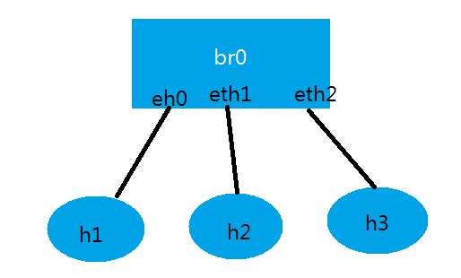
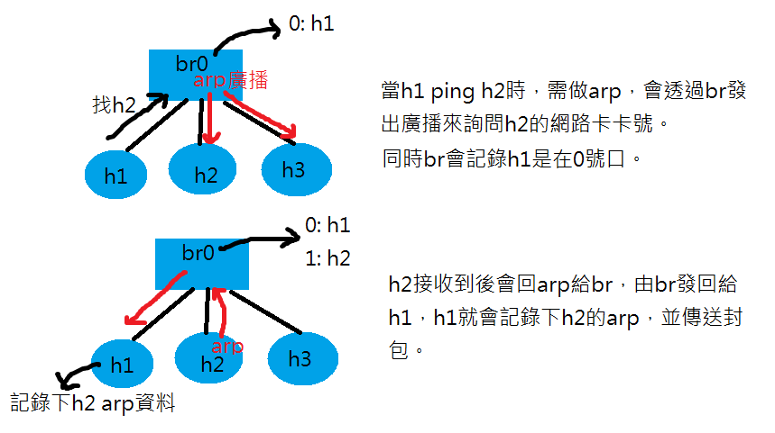
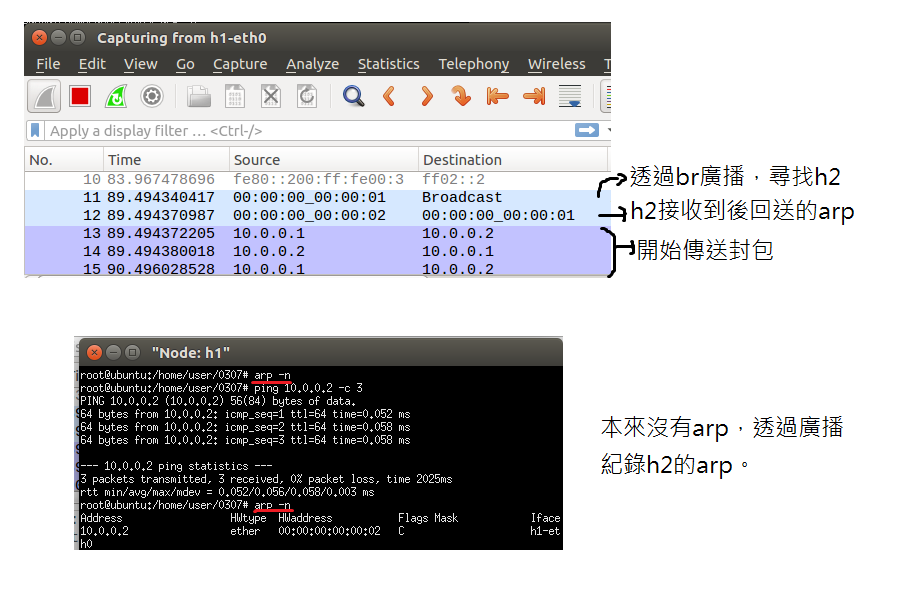
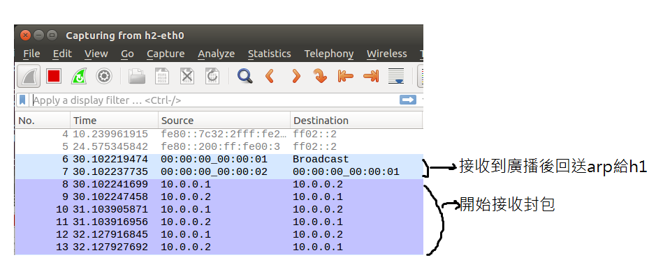
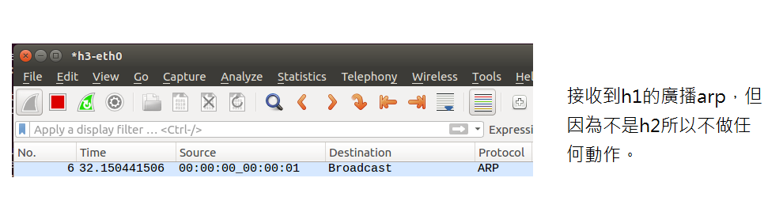
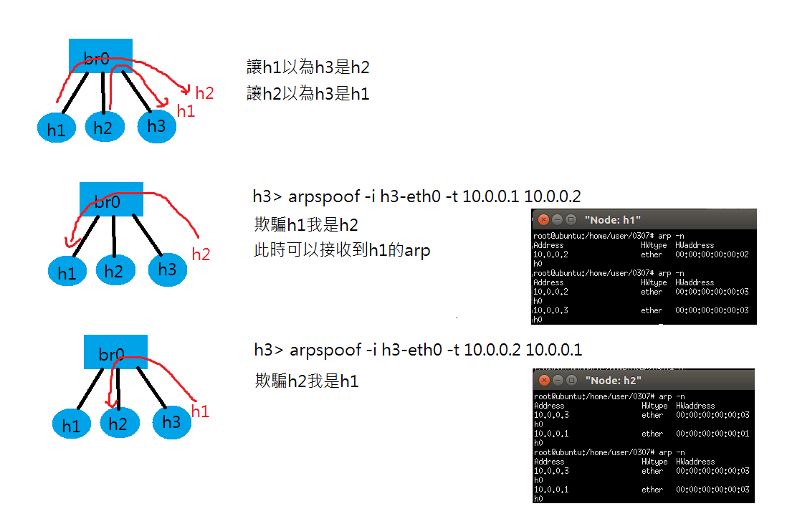
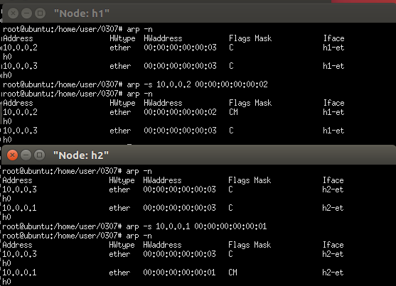
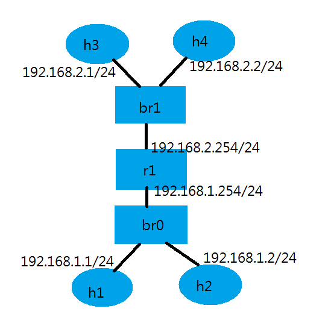

# 0307 第四週筆記

## 用腳本創建虛擬機器
### 範例一


* 1.py
```
#!/usr/bin/python

from mininet.cli import CLI  #command line interface
from mininet.net import Mininet
from mininet.link import Link,TCLink,Intf

if '__main__'==__name__:
  net=Mininet(link=TCLink)
  h1=net.addHost('h1')
  h2=net.addHost('h2')
  Link(h1,h2)
  net.build()
  CLI(net)  #命令提示符號
  net.stop()
  ```

  * 執行1.py
  ```
  # chmod +x 1.py
  # ./1.py
  mininet> xterm h1 h2  #開出h1 h2終端

  #互ping測試
  h1> ping 10.0.0.2
  h2> ping 10.0.0.1

  #如何重新配置IP
  h1> ifconfig h1-eth0 0
  h1> ip addr add 192.168.1.1/24 brd + dev h1-eth0
  h2> ifconfig h2-eth0 0
  h2> ip a a 192.168.1.1/24 brd + dev h1-eth0
  ```
### 範例二-將更改IP的指令直接寫在腳本中

  * 2.py
  ```
  #!/usr/bin/python

from mininet.cli import CLI
from mininet.net import Mininet
from mininet.link import Link,TCLink,Intf

if '__main__'==__name__:
  net=Mininet(link=TCLink)
  h1=net.addHost('h1')
  h2=net.addHost('h2')
  Link(h1,h2)
  net.build()
  h1.cmd("ifconfig h1-eth0 0")
  h1.cmd("ip a a 192.168.1.1/24 brd + dev h1-eth0")
  h2.cmd("ifconfig h2-eth0 0")
  h2.cmd("ip a a 192.168.1.2/24 brd + dev h2-eth0")
  CLI(net)
  net.stop()
  ```

### 範例三-創建三台機器，不同網域實現互ping


* 3.py
```
#!/usr/bin/python

from mininet.cli import CLI
from mininet.net import Mininet
from mininet.link import Link,TCLink,Intf

if '__main__'==__name__:
  net=Mininet(link=TCLink)
  h1=net.addHost('h1')
  h2=net.addHost('h2')
  h3=net.addHost('h3')
  Link(h1,h2)
  Link(h2,h3)
  net.build()
  h1.cmd("ifconfig h1-eth0 0")
  h1.cmd("ip a a 192.168.1.1/24 brd + dev h1-eth0")

  h2.cmd("ifconfig h2-eth0 0")
  h2.cmd("ip a a 192.168.1.2/24 brd + dev h2-eth0")
  h2.cmd("ifconfig h2-eth1 0")
  h2.cmd("ip a a 192.168.2.2/24 brd + dev h2-eth1")

  h3.cmd("ifconfig h3-eth0 0")
  h3.cmd("ip a a 192.168.2.1/24 brd + dev h3-eth0")

  h1.cmd("ip route add default via 192.168.1.2")
  h3.cmd("ip route add default via 192.168.2.2")
  h2.cmd("echo 1 > /proc/sys/net/ipv4/ip_forward")

  CLI(net)
  net.stop()
```
* 查看路由狀態
```
h1> routw -n
h1> ip route show
```

### 作業一-實現h1 h2通訊


```
#!/usr/bin/python

from mininet.cli import CLI
from mininet.net import Mininet
from mininet.link import Link,TCLink,Intf

if '__main__'==__name__:
  net=Mininet(link=TCLink)
  h1=net.addHost('h1')
  r1=net.addHost('r1')
  r2=net.addHost('r2')
  h2=net.addHost('h2')
  Link(h1,r1)
  Link(r1,r2)
  Link(r2,h2)
  net.build()
  h1.cmd("ifconfig h1-eth0 0")
  h1.cmd("ip a a 192.168.1.1/24 brd + dev h1-eth0")

  r1.cmd("ifconfig r1-eth0 0")
  r1.cmd("ip a a 192.168.1.2/24 brd + dev r1-eth0")
  r1.cmd("ifconfig r1-eth1 0")
  r1.cmd("ip a a 192.168.2.2/24 brd + dev r1-eth1")

  r2.cmd("ifconfig r2-eth0 0")
  r2.cmd("ip a a 192.168.2.1/24 brd + dev r2-eth0")
  r2.cmd("ifconfig r2-eth1 0")
  r2.cmd("ip a a 192.168.3.1/24 brd + dev r2-eth1")

  h2.cmd("ifconfig h2-eth0 0")
  h2.cmd("ip a a 192.168.3.2/24 brd + dev h2-eth0")

  h1.cmd("ip route add default via 192.168.1.2")
  r2.cmd("ip route add default via 192.168.2.2")
  r1.cmd("ip route add default via 192.168.2.1")
  h2.cmd("ip route add default via 192.168.3.1")

  r1.cmd("echo 1 > /proc/sys/net/ipv4/ip_forward")
  r2.cmd("echo 1 > /proc/sys/net/ipv4/ip_forward")
  CLI(net)
  net.stop()
```
### 範例四-透過交換機通訊


* 4.py
```
#!/usr/bin/python

from mininet.cli import CLI
from mininet.net import Mininet
from mininet.link import Link,TCLink,Intf

if '__main__'==__name__:
  net=Mininet(link=TCLink)
  h1=net.addHost('h1')
  h2=net.addHost('h2')
  h3=net.addHost('h3')
  br0=net.addHost('br0')
  Link(h1,br0)
  Link(h2,br0)
  Link(h3,br0)
  net.build()
  br0.cmd("brctl addbr mybr")
  br0.cmd("brctl addif mybr br0-eth0")
  br0.cmd("brctl addif mybr br0-eth1")
  br0.cmd("brctl addif mybr br0-eth2")
  #br0.cmd("brctl setageing mybr 0")  #將交換機設為hub，每次傳送封包都進行廣播
  br0.cmd("ifconfig mybr up")
  h1.cmd("ifconfig h1-eth0 down")
  h1.cmd("ifconfig h1-eth0 hw ether 00:00:00:00:00:01")
  h1.cmd("ifconfig h1-eth0 up")
  h2.cmd("ifconfig h2-eth0 down")
  h2.cmd("ifconfig h2-eth0 hw ether 00:00:00:00:00:02")
  h2.cmd("ifconfig h2-eth0 up")
  h3.cmd("ifconfig h3-eth0 down")
  h3.cmd("ifconfig h3-eth0 hw ether 00:00:00:00:00:03")
  h3.cmd("ifconfig h3-eth0 up")
  CLI(net)
  net.stop()
```
### 範例五-傳送封包前arp運作過程


* h1開wireshark觀察

* h2開wireshark觀察

* h3開wireshark觀察


### 範例六-arp poisoning
* 安裝dsniff
```
# apt install dsniff
``` 

* 攻擊流程圖


* 攻擊h1 h2
```
h3> arpspoof -i h3-eth0 -t 10.0.0.1 10.0.0.2
h3> arpspoof -i h3-eth0 -t 10.0.0.2 10.0.0.1
```


* 防範方法-綁定靜態arp


```
h1> arp -s 10.0.0.2 00:00:00:00:00:02
h2> arp -s 10.0.0.1 00:00:00:00:00:01
```

### 作業二

