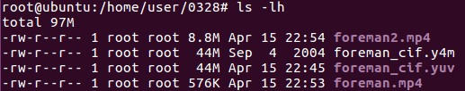
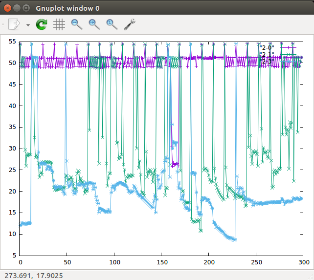

# 0328 第七週筆記

## FFMPEG實驗
* 安裝指令
```
# apt install ffmpeg
```

### 範例一-用ffmpeg壓縮影片並比較在不同的qp值下壓縮後影片的差異

* 執行指令
```
# wget https://media.xiph.org/video/derf/y4m/foreman_cif.y4m
# ffmpeg -i foreman_cif.y4m foreman_cif.yuv  ##yuv:以亮度色度來儲存影片

##以不同的qp值來壓縮影片，qp值越大壓縮出來的檔案越小
# ffmpeg -f rawvideo -s:v 352x288 -r 30 -i foreman_cif.yuv -c:v libx264 -qp 30 -g 12 -bf 2 -f mpeg foreman.mp4
# ffmpeg -f rawvideo -s:v 352x288 -r 30 -i foreman_cif.yuv -c:v libx264 -qp 10 -g 12 -bf 2 -f mpeg foreman2.mp4

##用肉眼比較兩者影片的解析度差異
# ffplay foreman.mp4
# ffplay foreman2.mp4
```
* 壓縮後的檔案大小比較



* 使用psnr來客觀分析實際的失真率

    psnr值越高，表示丟失率越低

* psnr.c
```
#include <math.h>
#include <stdio.h>
#include <stdlib.h>
#include <string.h>
#include <time.h>

int main(int n, char *cl[])
{
  FILE *f1, *f2;
  int i, x, y, yuv, inc = 1, size = 0, N = 0, Y, F;
  double yrmse, diff, mean = 0, stdv = 0, *ypsnr = 0;
  unsigned char *b1, *b2;
  int k=1;
  clock_t t = clock();

  if (n != 6 && n != 7) {
    puts("psnr x y <YUV format> <src.yuv> <dst.yuv> [multiplex]");
    puts("  x\t\tframe width");
    puts("  y\t\tframe height");
    puts("  YUV format\t420, 422, etc.");
    puts("  src.yuv\tsource video");
    puts("  dst.yuv\tdistorted video");
    puts("  [multiplex]\toptional");
    return EXIT_FAILURE;
  }

  if ((f1 = fopen(cl[4],"rb")) == 0) goto A;
  if ((f2 = fopen(cl[5],"rb")) == 0) goto B;
  if (!(x = strtoul(cl[1], 0, 10)) ||
      !(y = strtoul(cl[2], 0, 10))) goto C; 
  if ((yuv = strtoul(cl[3], 0, 10)) > 444) goto D;
  if (cl[6] && !strcmp(cl[6], "multiplex")) inc = 2;

  Y = x * y;
  switch (yuv) {
    case 400: F = Y; break;
    case 422: F = Y * 2; break;
    case 444: F = Y * 3; break;
    default :
    case 420: F = Y * 3 / 2; break;
  }

  if (!(b1 = malloc(F))) goto E;
  if (!(b2 = malloc(F))) goto E;

  for (;;) {
    if (1 != fread(b1, F, 1, f1) || 1 != fread(b2, F, 1, f2)) break;
    for (yrmse=0, i=inc-1; i<(inc==1 ? Y : F); i+=inc) {
      diff = b1[i] - b2[i];
      yrmse += diff * diff;
    }
    if (++N > size) {
      size += 0xffff;
      if (!(ypsnr = realloc(ypsnr, size * sizeof *ypsnr))) goto E;
    }

    mean += ypsnr[N-1] = yrmse ? 20 * (log10(255 / sqrt(yrmse / Y))) : 0;
    printf("%d\t%.2f\n", k++, ypsnr[N-1]);
  }

  if (N) {
    mean /= N;

    for (stdv=0, i=0; i<N; i++) {
      diff = ypsnr[i] - mean;
      stdv += diff * diff;
    }
    stdv = sqrt(stdv / (N - 1));

    free(ypsnr);
  }

  fclose(f1);
  fclose(f2);

  //fprintf(stderr, "psnr:\t%d frames (CPU: %lu s) mean: %.2f stdv: %.2f\n",
  //  N, (unsigned long) ((clock() - t) / CLOCKS_PER_SEC), mean, stdv);

  return 0;

A: fprintf(stderr, " Error opening sourcefile.\n"); goto X;
B: fprintf(stderr, " Error opening decodedfile.\n"); goto X;
C: fprintf(stderr, " Invalid width or height.\n"); goto X;
D: fprintf(stderr, " Invalid YUV format.\n"); goto X;
E: fprintf(stderr, " Not enough memory.\n");

X: return EXIT_FAILURE;
}


```

* 執行指令
```
# gcc -o psnr psnr.c -lm  ##編譯出psnr執行檔

##分別將兩個影片解壓縮
# ffmpeg -i foreman.mp4 1.yuv
# ffmpeg -i foreman2.mp4 2.yuv

# ./psnr 352 288 420 foreman_cif.yuv 1.yuv > psnr1
# ./psnr 352 288 420 foreman_cif.yuv 2.yuv > psnr2

##用gnuplot繪圖進行比較
# gnuplot
gnuplot> plot "psnr1" with linespoints, "psnr2" with lines points
```
### 範例二-更改遺失率觀察視訊串流的丟失情形
* 3-1.py
```
#!/usr/bin/python

from mininet.cli import CLI
from mininet.net import Mininet
from mininet.link import Link,TCLink,Intf

if '__main__'==__name__:
  net=Mininet(link=TCLink)
  h1=net.addHost('h1')
  h2=net.addHost('h2')
  r=net.addHost('r')
  h1r = {'bw':100,'delay':'1ms','loss':0}
  net.addLink(h1, r, cls=TCLink , **h1r)
  h2r = {'bw':100,'delay':'1ms','loss':0}
  net.addLink(h2, r, cls=TCLink , **h2r)
  Link(h1,r)
  Link(h2,r)
  net.build()

  h1.cmd("ifconfig h1-eth0 0")
  h1.cmd("ip a a 192.168.1.1/24 brd + dev h1-eth0")
  h1.cmd("ip route add default via 192.168.1.254")
  h2.cmd("ifconfig h2-eth0 0")
  h2.cmd("ip a a 192.168.2.1/24 brd + dev h2-eth0")
  h2.cmd("ip route add default via 192.168.2.254")

  r.cmd("ifconfig r-eth0 0")
  r.cmd("ifconfig r-eth1 0")
  r.cmd("ip a a 192.168.1.254/24 brd + dev r-eth0")
  r.cmd("ip a a 192.168.2.254/24 brd + dev r-eth1")
  r.cmd("echo 1 > /proc/sys/net/ipv4/ip_forward")
  CLI(net)
  net.stop()
```

* 執行指令
```
# ./3-1.py
mininet> xterm h1 h2
h2> ffplay -i udp://192.168.2.1:1234
h1> ffmpeg -re -i foreman.mp4 -c copy -f mpegts udp://192.168.2.1:1234

##更改3-1.py中h2r的遺失率再串流一次('loss':10)
# ./3-1.py
mininet> xterm h1 h2
h2> ffplay -i udp://192.168.2.1:1234
h1> ffmpeg -re -i foreman.mp4 -c copy -f mpegts udp://192.168.2.1:1234
```
### 範例三-將串流的接收情形分析成圖表
* 執行指令
```
##loss:0
# ./3-1.py
mininet> xterm h1 h2
h2> ffmpeg -i udp://192.168.2.1:1234 -c copy 2-0.ts
h1> ffmpeg -re -i foreman2.mp4 -c copy -f mpegts udp://192.168.2.1:1234
h2> ffmpeg -i 2-0.ts 2-0.yuv
h2> ./psnr 352 288 420 foreman_cif.yuv 2-0.yuv > 2-0

##loss:1
# ./3-1.py
mininet> xterm h1 h2
h2> ffmpeg -i udp://192.168.2.1:1234 -c copy 2-1.ts
h1> ffmpeg -re -i foreman2.mp4 -c copy -f mpegts udp://192.168.2.1:1234
h2> ffmpeg -i 2-1.ts 2-1.yuv
h2> ./psnr 352 288 420 foreman_cif.yuv 2-1.yuv > 2-1

##loss:3
# ./3-1.py
mininet> xterm h1 h2
h2> ffmpeg -i udp://192.168.2.1:1234 -c copy 1-3.ts
h1> ffmpeg -re -i foreman2.mp4 -c copy -f mpegts udp://192.168.2.1:1234
h2> ffmpeg -i 2-3.ts 2-3.yuv
h2> ./psnr 352 288 420 foreman_cif.yuv 2-3.yuv > 2-3

##繪製圖表
# gnuplot
gnuplot> plot "2-0" with linespoints, "2-1" with linespoints, "2-3" with linespoints
```



### 範例四-比較udp及rdp傳輸的不同
* 執行指令
```
##loss:1
# ./3-1.py
mininet> xterm h1 h2
##udp
h2> ffplay -i udp://192.168.2.1:1234
h1> ffmpeg -re -i foreman2.mp4 -f mpegts udp://192.168.2.1:1234
##rtp
h2> ffplay -i rtp://192.168.2.1:1234
h1> ffmpeg -re -i foreman2.mp4 -f rtp_mpegts udp://192.168.2.1:1234

```