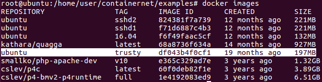
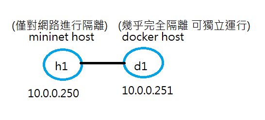
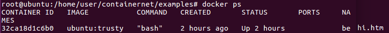
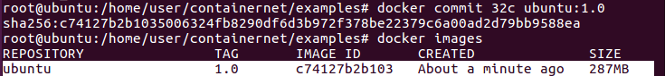
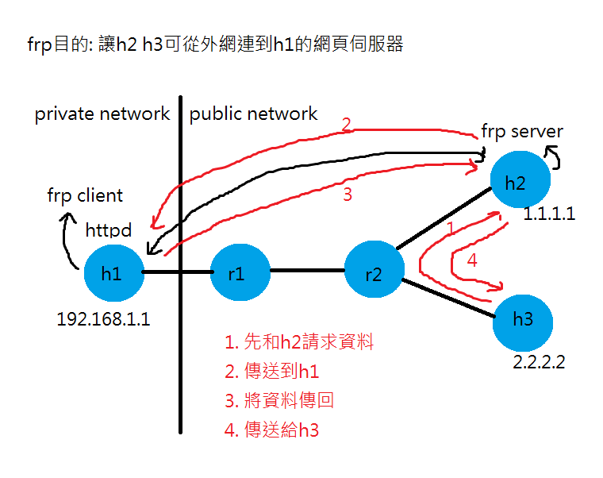
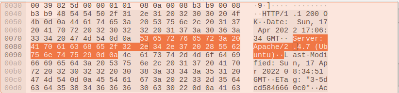
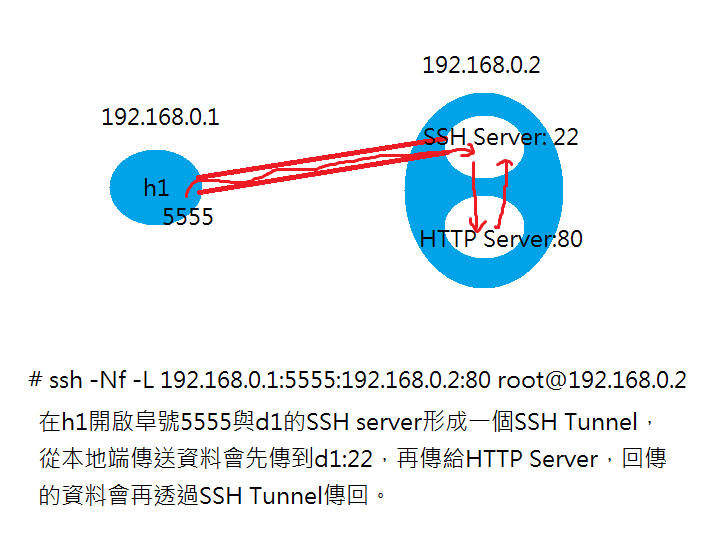

# 0411 第九週筆記

## Docker
* 環境測試
```
# cd /home/user/containernet
# python3 ./setup.py install
# cd /home/user/containernet/examples
# python3 dockerhosts.py
containernet> h1 ping -c 3 d1

# docker images
```
檢查是否有此鏡像



如果沒有
```
# docker pull ubuntu:trusty
```
### 範例一-與docker互ping測試
* dockerhost1.py
```
#!/usr/bin/python

"""
This example shows how to create a simple network and
how to create docker containers (based on existing images)
to it.
"""

from mininet.net import Containernet
from mininet.node import Controller, Docker, OVSSwitch
from mininet.cli import CLI
from mininet.log import setLogLevel, info
from mininet.link import TCLink, Link


def topology():

    "Create a network with some docker containers acting as hosts."

    net = Containernet()

    info('*** Adding hosts\n')
    h1 = net.addHost('h1',  ip='10.0.0.250')

    info('*** Adding docker containers\n')
    d1 = net.addDocker('d1', ip='10.0.0.251', dimage="ubuntu:trusty")
    
    info('*** Creating links\n')
    net.addLink(h1, d1)
   
    info('*** Starting network\n')
    net.start()

    info('*** Running CLI\n')
    CLI(net)

    info('*** Stopping network')
    net.stop()

if __name__ == '__main__':
    setLogLevel('info')
    topology()
```


* 執行指令
```
# cd /home/user/containernet/examples
# gedit dockerhost1.py
# chmod +x dockerhost1.py
# python3 dockerhost1.py
containernet> xterm h1
#2> docker ps  ##查看docker名稱
#2> docker exec -it mn.d1 bash
root@d1:/# ifconfig
h1> ping 10.0.0.251
```

### 範例二-下載ssh伺服器
* 執行指令
```
# docker run -it ubuntu:trusty bash
root@32ca18d1c6b0:/# apt update
root@32ca18d1c6b0:/# apt install openssh-server apache2 vim -y
root@32ca18d1c6b0:/# vim /etc/ssh/sshd_config  ##root遠端登入預設是關閉的

##在vim中按a編輯將PermitRootLogin設為yes，並按:wq儲存離開

root@32ca18d1c6b0:/# /etc/init.d/ssh start  ##啟動ssh伺服器
root@32ca18d1c6b0:/# /etc/init.d/ssh status  ##查看伺服器狀態
root@32ca18d1c6b0:/# passwd root  ##(ubuntu)
#2 ssh root@172.17.0.3
```

### 範例三-網頁伺服器
* 執行指令
```
root@32ca18d1c6b0:/# /etc/init.d/apache2 start  ##啟動ssh伺服器
root@32ca18d1c6b0:/# /etc/init.d/apache2 status  ##查看伺服器狀態
root@32ca18d1c6b0:/# cd /var/www/html
root@32ca18d1c6b0:/# echo "hi" > hi.htm
#2 curl 172.17.0.3/hi.htm
```

### 範例四-製作一個新docker鏡像
* 先查看docker



* 執行指令
```
# docker commit 32c ubuntu:1.0
# docker rm -f 32c
# docker images  ##查看新增後的鏡像
```



* dockerhost1.py-變更到新的鏡像
```
#!/usr/bin/python

"""
This example shows how to create a simple network and
how to create docker containers (based on existing images)
to it.
"""

from mininet.net import Containernet
from mininet.node import Controller, Docker, OVSSwitch
from mininet.cli import CLI
from mininet.log import setLogLevel, info
from mininet.link import TCLink, Link


def topology():

    "Create a network with some docker containers acting as hosts."

    net = Containernet()

    info('*** Adding hosts\n')
    h1 = net.addHost('h1',  ip='10.0.0.250')

    info('*** Adding docker containers\n')
    d1 = net.addDocker('d1', ip='10.0.0.251', dimage="ubuntu:1.0")  ##更改為複製的鏡像
    
    info('*** Creating links\n')
    net.addLink(h1, d1)
   
    info('*** Starting network\n')
    net.start()
    ##將伺服器啟動
    d1.cmd("/etc/init.d/ssh start")
    d1.cmd("/etc/init.d/apache2 start")

    info('*** Running CLI\n')
    CLI(net)

    info('*** Stopping network')
    net.stop()

if __name__ == '__main__':
    setLogLevel('info')
    topology()
```

* 測試伺服器是否正常
```
# cd /home/user/containernet/examples
# gedit dockerhost1.py
# python3 dockerhost1.py
containernet> xterm h1
h1> ssh root@10.0.0.251
h1> ssh-keygen -f "/root/.ssh/known_hosts" -R 10.0.0.251
h1> curl 10.0.0.251/hi.htm

```

### 範例五-透過frp server讓外網可以連到內網的網頁伺服器
* 運作方式



* test.py
```
#!/usr/bin/python
from mininet.net import Mininet
from mininet.link import Link, TCLink
from mininet.cli import CLI
from mininet.log import setLogLevel
 
def topology():
    "Create a network."
    net = Mininet()
 
    print "*** Creating nodes"
    h1 = net.addHost( 'h1', ip="192.168.1.1/24") #private server
    h2 = net.addHost( 'h2', ip="1.1.1.1/24") #public server
    h3 = net.addHost( 'h3', ip="2.2.2.2/24") #public node
    r1 = net.addHost( 'r1')
    r2 = net.addHost( 'r2')
 
    ####  h1 --- r1 ---r2----h3
    ####               |
    ####               h2
 
    print "*** Creating links"
    net.addLink(h1, r1)
    net.addLink(r1, r2)
    net.addLink(r2, h2)
    net.addLink(r2, h3)
 
    print "*** Starting network"
    net.build()
 
    print "*** Running CLI"
    r1.cmd("echo 1 > /proc/sys/net/ipv4/ip_forward")
    r2.cmd("echo 1 > /proc/sys/net/ipv4/ip_forward")
    r1.cmd("ifconfig r1-eth0 0")
    r1.cmd("ifconfig r1-eth1 0")
    r2.cmd("ifconfig r2-eth0 0")
    r2.cmd("ifconfig r2-eth1 0")
    r2.cmd("ifconfig r2-eth2 0")
    r1.cmd("ip addr add 192.168.1.254/24 brd + dev r1-eth0")
    r1.cmd("ip addr add 12.1.1.1/24 brd + dev r1-eth1")
    r2.cmd("ip addr add 12.1.1.2/24 brd + dev r2-eth0")
    r2.cmd("ip addr add 1.1.1.254/24 brd + dev r2-eth1")
    r2.cmd("ip addr add 2.2.2.254/24 brd + dev r2-eth2")
    h1.cmd("ip route add default via 192.168.1.254")
    h2.cmd("ip route add default via 1.1.1.254")
    h3.cmd("ip route add default via 2.2.2.254")
    r2.cmd("ip route add 12.1.1.0/24 via 12.1.1.1")
    r1.cmd("ip route add 1.1.1.0/24 via 12.1.1.2")
    r1.cmd("ip route add 2.2.2.0/24 via 12.1.1.2")
    r1.cmd("iptables -t nat -A POSTROUTING -s 192.168.1.0/24 -o r1-eth1 -j MASQUERADE")
 
    CLI( net )
 
    print "*** Stopping network"
    net.stop()
 
if __name__ == '__main__':
    setLogLevel( 'info' )
    topology()
```
* 執行指令
```
# cd /home/user/server-test/test-frp
# python test.py
mininet> xterm h1 h1 h2 h3
h1(1)> echo "hi" > hi.htm
h1(1)> python -m SimpleHTTPServer 80
h2> cd frp/conf
h2> ./frps -c frps.ini
h1(2)> cd frp/conf
h1(2)> ./frpc -c frpc.ini
h3> curl www.example.com:8080/hi.htm
```
## SSH Tunnel
### 範例一-透過sshtunnel來傳輸http server的資料，讓資料更安全
* 1.py
```
#!/usr/bin/python
from mininet.net import Containernet
from mininet.node import Docker
from mininet.cli import CLI
from mininet.log import setLogLevel, info
from mininet.link import TCLink, Link
 
def topology():
 
    "Create a network with some docker containers acting as hosts."
    net = Containernet()
 
    info('*** Adding hosts\n')
    h1 = net.addHost('h1', ip='192.168.0.1/24')
    d1 = net.addDocker('d1', ip='192.168.0.2/24', dimage="ubuntu:1.0")
 
    info('*** Creating links\n')
    net.addLink(h1, d1)
   
    info('*** Starting network\n')
    net.start()
    d1.cmd("/etc/init.d/ssh start")
    #d1.cmd("/etc/init.d/apache2 start")
    #h1.cmd("ssh -Nf -L 192.168.0.1:5555:192.168.0.2:80 user@192.168.0.2")   
 
    info('*** Running CLI\n')
    CLI(net)
 
    info('*** Stopping network')
    net.stop()
 
if __name__ == '__main__':
    setLogLevel('info')
    topology()
```
* 執行指令
```
# cd /home/user/server-test/test-sshtunnel
# python3 1.py
containernet> xterm h1 h1
#(2) docker ps
#(2) # docker exec -it mn.d1 bash
root@d1:/# /etc/init.d/ssh start
root@d1:/# /etc/init.d/apache2 start
h1(1)> wireshark
h1(2)> curl 192.168.0.2/hi.htm
```
* 傳送過程仍可以輕鬆辨識部分內容



* 使用SSH Tunnel來傳輸


* 執行指令
```
h1> ssh -Nf -L 192.168.0.1:5555:192.168.0.2:80 root@192.168.0.2
h1> netstat -tunlp | grep 5555
h1> curl 192.168.0.1:5555/hi.htm
```
