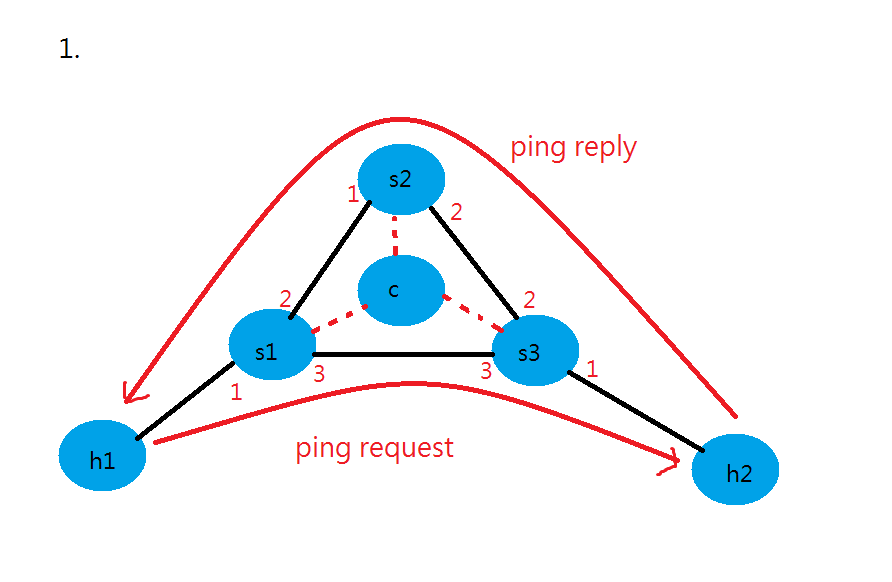
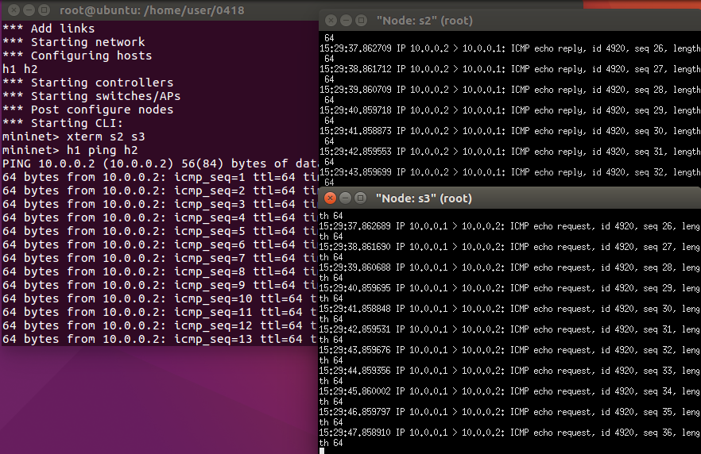
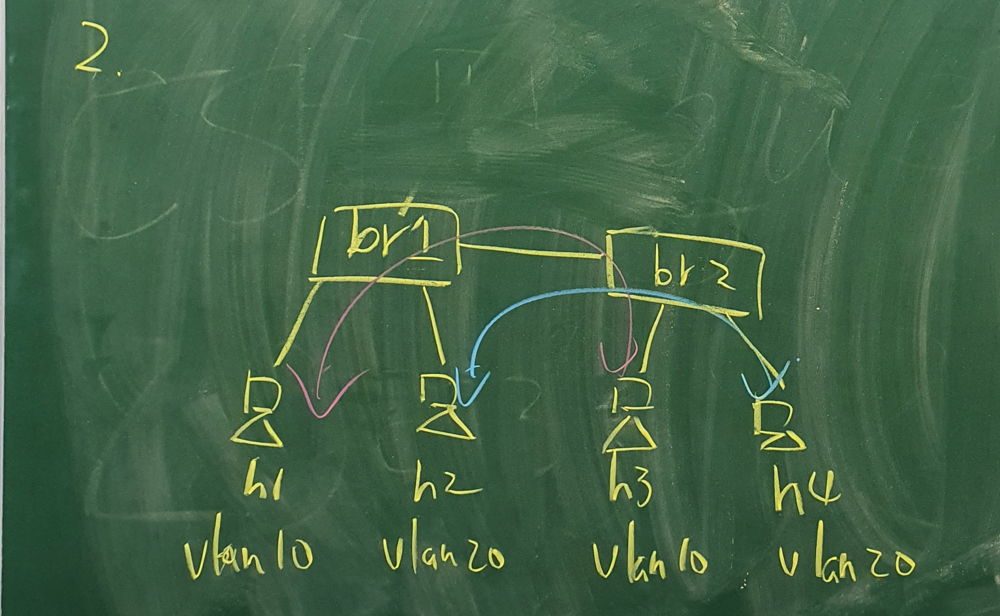
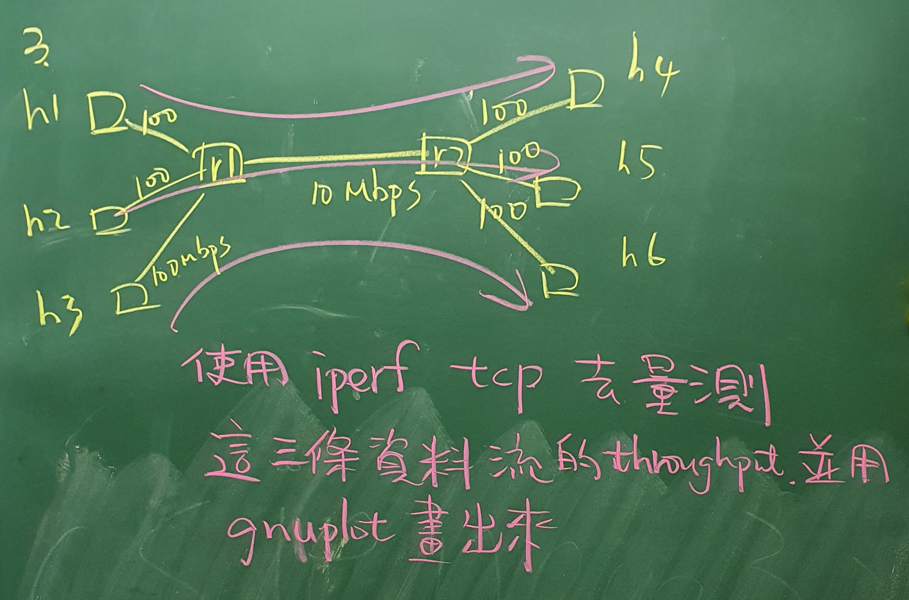
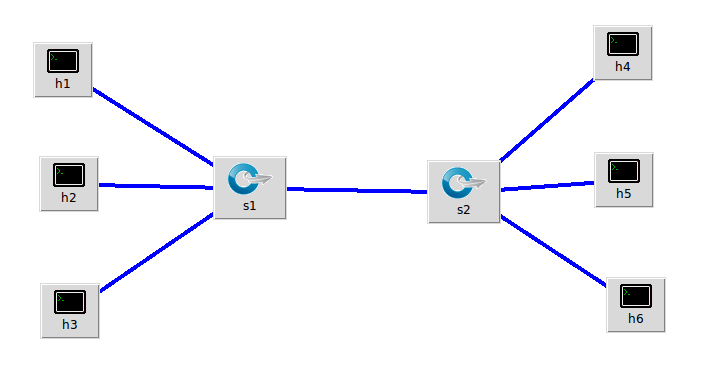
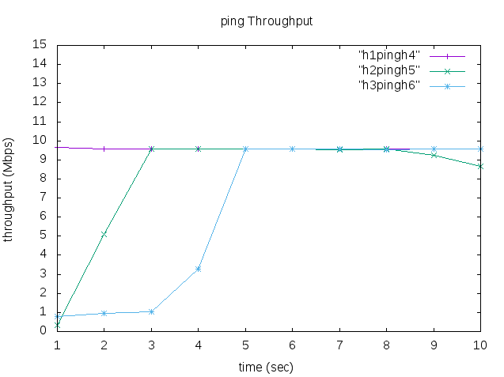
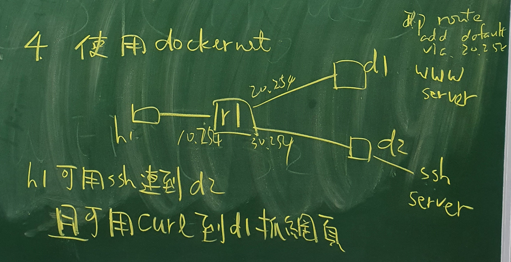
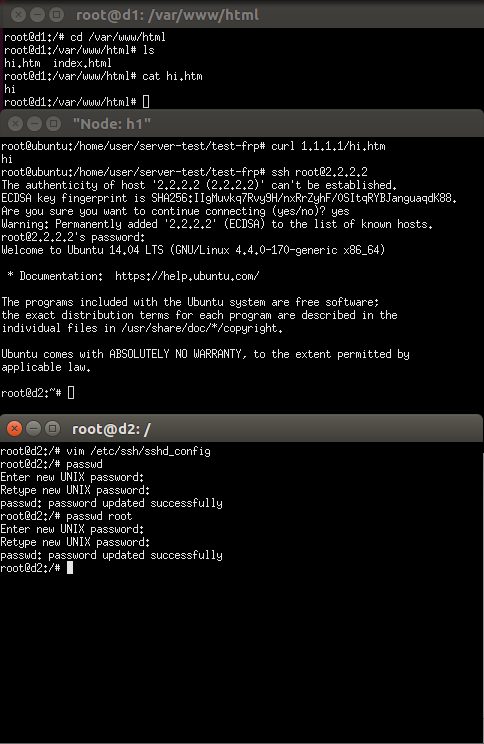

# 0418 第十週期中考
## 1. h1 ping h2 來回走不同路徑



* test1.py
```
#!/usr/bin/python

from mininet.net import Mininet
from mininet.node import RemoteController, OVSKernelSwitch, Host
from mininet.cli import CLI
from mininet.link import TCLink, Intf
from mininet.log import setLogLevel, info
from subprocess import call


def myNetwork():

    net = Mininet(topo=None,
                       build=False,
                       ipBase='10.0.0.0/8')

    info( '*** Adding controller\n' )
    c0 = net.addController(name='c0',
                           controller=RemoteController,
                           ip='127.0.0.1',
                           protocol='tcp',
                           port=6633)

    info( '*** Add switches/APs\n')
    s3 = net.addSwitch('s3', cls=OVSKernelSwitch)
    s2 = net.addSwitch('s2', cls=OVSKernelSwitch)
    s1 = net.addSwitch('s1', cls=OVSKernelSwitch)

    info( '*** Add hosts/stations\n')
    h1 = net.addHost('h1', cls=Host, ip='10.0.0.1/24', mac="00:00:00:00:00:01", defaultRoute=None)
    h2 = net.addHost('h2', cls=Host, ip='10.0.0.2/24', mac="00:00:00:00:00:02", defaultRoute=None)
   

    info( '*** Add links\n')
    net.addLink(h1, s1)
    net.addLink(h2, s3)
    net.addLink(s1, s2)
    net.addLink(s2, s3)
    net.addLink(s1, s3)

    info( '*** Starting network\n')
    net.build()
    info( '*** Starting controllers\n')
    for controller in net.controllers:
        controller.start()

    info( '*** Starting switches/APs\n')
    net.get('s3').start([c0])
    net.get('s2').start([c0])
    net.get('s1').start([c0])
    net.get('h1').cmd("arp -s 10.0.0.2 00:00:00:00:00:02")
    net.get('h2').cmd("arp -s 10.0.0.1 00:00:00:00:00:01")
    net.get('s1').cmd("ovs-ofctl add-flow s1 ip,nw_src=10.0.0.1,nw_dst=10.0.0.2,actions=output:3")
    net.get('s1').cmd("ovs-ofctl add-flow s1 ip,nw_src=10.0.0.2,nw_dst=10.0.0.1,actions=output:1")
    net.get('s3').cmd("ovs-ofctl add-flow s3 ip,nw_src=10.0.0.1,nw_dst=10.0.0.2,actions=output:1")
    net.get('s3').cmd("ovs-ofctl add-flow s3 ip,nw_src=10.0.0.2,nw_dst=10.0.0.1,actions=output:2")
    net.get('s2').cmd("ovs-ofctl add-flow s2 ip,nw_src=10.0.0.2,nw_dst=10.0.0.1,actions=output:1")
    

    info( '*** Post configure nodes\n')

    CLI(net)
    net.stop()


if __name__ == '__main__':
    setLogLevel( 'info' )
    myNetwork()
```
* 執行指令
```
# python test1.py
mininet> xterm s2 s3
s2> tcpdump -i s2-eth1
s3> tcpdump -i s3-eth3
mininet> h1 ping h2
```
* 執行結果



## 2. 製作vlan10、vlan20兩個不同通道(未完成)



* test2.py
```
#!/usr/bin/python
from mininet.net import Mininet
from mininet.cli import CLI
from mininet.link import Link,TCLink,Intf

if '__main__' == __name__:
  net = Mininet(link=TCLink)
  #h1 is under vlan10
  h1 = net.addHost('h1')
  #h2 is under vlan20
  h2 = net.addHost('h2')
  #h3 is under vlan10
  h3 = net.addHost('h3')
  #h4 is under vlan20
  h4 = net.addHost('h4')
  #s1 is a switch
  s1 = net.addHost('s1')
  #s2 is a switch
  s2 = net.addHost('s2')
  
  Link(h1, s1)
  Link(h2, s1)
  Link(h3, s2)
  Link(h4, s2)
  Link(s1, s2)
  net.build()
  
  s1.cmd("ifconfig s1-eth0 0")
  s1.cmd("ifconfig s1-eth1 0")
  s1.cmd("ifconfig s1-eth2 0")
  s2.cmd("ifconfig s2-eth0 0")
  s2.cmd("ifconfig s2-eth1 0")
  s2.cmd("ifconfig s2-eth2 0")
  s1.cmd("vconfig add s1-eth2 10")  ##創造兩個邏輯線路(trunk)
  s1.cmd("vconfig add s1-eth2 20")
  s2.cmd("vconfig add s2-eth2 10")
  s2.cmd("vconfig add s2-eth2 20")
  s1.cmd("ifconfig s1-eth2.10 up")
  s1.cmd("ifconfig s1-eth2.20 up")
  s2.cmd("ifconfig s2-eth2.10 up")
  s2.cmd("ifconfig s2-eth2.20 up")
  s1.cmd("brctl addbr brvlan10")
  s1.cmd("brctl addbr brvlan20")
  s1.cmd("brctl addif brvlan10 s1-eth0")
  s1.cmd("brctl addif brvlan20 s1-eth1")
  s1.cmd("brctl addif brvlan10 s1-eth2.10")
  s1.cmd("brctl addif brvlan20 s1-eth2.20")
  s2.cmd("brctl addbr brvlan10")
  s2.cmd("brctl addbr brvlan20")
  s2.cmd("brctl addif brvlan10 s2-eth0")
  s2.cmd("brctl addif brvlan20 s2-eth1")
  s2.cmd("brctl addif brvlan10 s2-eth2.10")
  s2.cmd("brctl addif brvlan20 s2-eth2.20")
  s1.cmd("ifconfig brvlan10 up")
  s1.cmd("ifconfig brvlan20 up")
  s2.cmd("ifconfig brvlan10 up")
  s2.cmd("ifconfig brvlan20 up")
  h1.cmd("ifconfig h1-eth0 10.0.10.1 netmask 255.255.255.0")
  h2.cmd("ifconfig h2-eth0 10.0.10.2 netmask 255.255.255.0")
  h3.cmd("ifconfig h3-eth0 10.0.10.3 netmask 255.255.255.0")
  h4.cmd("ifconfig h4-eth0 10.0.10.4 netmask 255.255.255.0")
  CLI(net)
  net.stop()
```
## 3. 使用iperf繪製不同路線的速度





* test3.py
```
#!/usr/bin/python

from mininet.cli import CLI
from mininet.net import Mininet
from mininet.link import Link,TCLink,Intf

if '__main__'==__name__:
  net=Mininet(link=TCLink)
  h1=net.addHost('h1')
  h2=net.addHost('h2')
  h3=net.addHost('h3')
  h4=net.addHost('h4')
  h5=net.addHost('h5')
  h6=net.addHost('h6')
  s1=net.addHost('s1')
  s2=net.addHost('s2')

  h1s1 = {'bw':100,'delay':'1ms','loss':0}
  net.addLink(h1, s1, cls=TCLink , **h1s1)
  h2s1 = {'bw':100,'delay':'1ms','loss':0}
  net.addLink(h2, s1, cls=TCLink , **h2s1)
  h3s1 = {'bw':100,'delay':'1ms','loss':0}
  net.addLink(h3, s1, cls=TCLink , **h3s1)
  h4s2 = {'bw':100,'delay':'1ms','loss':0}
  net.addLink(h4, s2, cls=TCLink , **h4s2)
  h5s2 = {'bw':100,'delay':'1ms','loss':0}
  net.addLink(h5, s2, cls=TCLink , **h5s2)
  h6s2 = {'bw':100,'delay':'1ms','loss':0}
  net.addLink(h6, s2, cls=TCLink , **h6s2)
  s1s2 = {'bw':10,'delay':'1ms','loss':0}
  net.addLink(s1, s2, cls=TCLink , **s1s2)

  Link(h1,s1)
  Link(h2,s1)
  Link(h3,s1)
  Link(h4,s2)
  Link(h5,s2)
  Link(h6,s2)
  Link(s1,s2)

  net.build()

  h1.cmd("ifconfig h1-eth0 0")
  h1.cmd("ip a a 10.0.1.1/24 brd + dev h1-eth0")
  h2.cmd("ifconfig h2-eth0 0")
  h2.cmd("ip a a 10.0.2.1/24 brd + dev h2-eth0")
  h3.cmd("ifconfig h3-eth0 0")
  h3.cmd("ip a a 10.0.3.1/24 brd + dev h3-eth0")
  h4.cmd("ifconfig h4-eth0 0")
  h4.cmd("ip a a 10.0.4.1/24 brd + dev h4-eth0")
  h5.cmd("ifconfig h5-eth0 0")
  h5.cmd("ip a a 10.0.5.1/24 brd + dev h5-eth0")
  h6.cmd("ifconfig h6-eth0 0")
  h6.cmd("ip a a 10.0.6.1/24 brd + dev h6-eth0")
  s1.cmd("echo 1 > /proc/sys/net/ipv4/ip_forward")
  s2.cmd("echo 1 > /proc/sys/net/ipv4/ip_forward")
  s1.cmd("ip addr add 12.1.1.1/24 brd + dev s1-eth3")
  s2.cmd("ip addr add 12.1.1.2/24 brd + dev s2-eth3")
  s1.cmd("ip addr add 10.0.1.254/24 brd + dev s1-eth0")
  s1.cmd("ip addr add 10.0.2.254/24 brd + dev s1-eth1")
  s1.cmd("ip addr add 10.0.3.254/24 brd + dev s1-eth2")
  s2.cmd("ip addr add 10.0.4.254/24 brd + dev s2-eth0")
  s2.cmd("ip addr add 10.0.5.254/24 brd + dev s2-eth1")
  s2.cmd("ip addr add 10.0.6.254/24 brd + dev s2-eth2")
  h1.cmd("ip route add default via 10.0.1.254")
  h2.cmd("ip route add default via 10.0.2.254")
  h3.cmd("ip route add default via 10.0.3.254")
  h4.cmd("ip route add default via 10.0.4.254")
  h5.cmd("ip route add default via 10.0.5.254")
  h6.cmd("ip route add default via 10.0.6.254")
  s1.cmd("ip route add 10.0.4.0/24 via 12.1.1.2")
  s2.cmd("ip route add 10.0.1.0/24 via 12.1.1.1")
  s1.cmd("ip route add 10.0.5.0/24 via 12.1.1.2")
  s2.cmd("ip route add 10.0.2.0/24 via 12.1.1.1")
  s1.cmd("ip route add 10.0.6.0/24 via 12.1.1.2")
  s2.cmd("ip route add 10.0.3.0/24 via 12.1.1.1")
  CLI(net)
  net.stop()
```

* plot.plt
```
plot "h1pingh4" with linespoints, "h2pingh5" with linespoints, "h3pingh6" with linespoints
set xlabel "time (sec)"
set ylabel "throughput (Mbps)"
set xrange [1:10]
set xtics 0,1,10
set yrange [0:10]
set ytics 0,1,10
set title "ping Throughput"
set terminal gif
set output "result.gif"
replot
```

* 執行指令
```
# python test3.py
mininet> xterm h1 h2 h3 h4 h5 h6
h4> iperf -s -i 1 | tee h1h4result
h1> iperf -c 10.0.0.4 -t 10
h5> iperf -s -i 1 | tee h2h5result
h2> iperf -c 10.0.0.5 -t 10
h6> iperf -s -i 1 | tee h3h6result
h3> iperf -c 10.0.0.6 -t 10
mininet> exit
# cat h1h4result | grep "sec" | head -n 10 | tr "-" " " | awk '{print $4,$8}' > h1pingh4
# cat h2h5result | grep "sec" | head -n 10 | tr "-" " " | awk '{print $4,$8}' > h2pingh5
# cat h3h6result | grep "sec" | head -n 10 | tr "-" " " | awk '{print $4,$8}' > h3pingh6
# gnuplot plot.plt
```

* 執行結果



## 4. h1 可用ssh和https



* test4.py
```
#!/usr/bin/python
from mininet.net import Mininet
from mininet.link import Link, TCLink
from mininet.cli import CLI
from mininet.log import setLogLevel, info
from mininet.net import Containernet
from mininet.node import Controller, Docker, OVSSwitch

 
def topology():
    "Create a network."
    net = Containernet()
 
    #print "*** Creating nodes"
    h1 = net.addHost( 'h1', ip='192.168.1.1/24')
    r1 = net.addHost( 'r1')

    info('*** Adding docker containers\n')
    d1 = net.addDocker('d1', ip='1.1.1.1', dimage="ubuntu:1.0")
    d2 = net.addDocker('d2', ip='2.2.2.2', dimage="ubuntu:1.0")
    #print "*** Creating links"
    net.addLink(h1, r1)
    net.addLink(r1, d1)
    net.addLink(r1, d2)
 
    #print "*** Starting network"
    net.start()
 
    #print "*** Running CLI"
    r1.cmd("echo 1 > /proc/sys/net/ipv4/ip_forward")
    r1.cmd("ifconfig r1-eth0 0")
    r1.cmd("ifconfig r1-eth1 0")
    r1.cmd("ifconfig r1-eth2 0")
    r1.cmd("ip addr add 192.168.1.254/24 brd + dev r1-eth0")
    r1.cmd("ip addr add 1.1.1.254/24 brd + dev r1-eth1")
    r1.cmd("ip addr add 2.2.2.254/24 brd + dev r1-eth2")

    h1.cmd("ip route add default via 192.168.1.254")
    d1.cmd("ip route add default via 1.1.1.254")
    d2.cmd("ip route add default via 2.2.2.254")

    r1.cmd("iptables -t nat -A POSTROUTING -s 192.168.1.0/24 -o r1-eth1 -j MASQUERADE")
    r1.cmd("iptables -t nat -A POSTROUTING -s 192.168.1.0/24 -o r1-eth2 -j MASQUERADE")

    d1.cmd("/etc/init.d/apache2 start")
    d2.cmd("/etc/init.d/ssh start")
 
    CLI(net)
 
    #print "*** Stopping network"exit

    net.stop()
 
if __name__ == '__main__':
    setLogLevel( 'info' )
    topology()
```

* 執行結果

