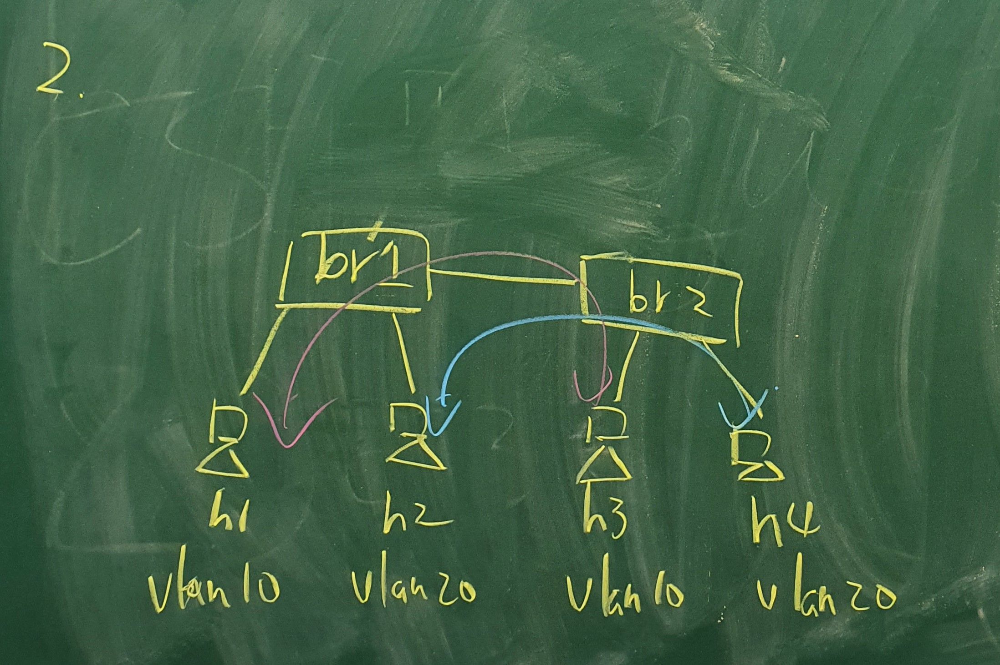

# 0425 第十一週筆記

## 期中範例解答
### vlan



* test-vlan.py
```
#!/usr/bin/python
from mininet.net import Mininet
from mininet.cli import CLI
from mininet.link import Link,TCLink,Intf

if '__main__' == __name__:
  net = Mininet(link=TCLink)
  #h1 is under vlan10
  h1 = net.addHost('h1')
  #h2 is under vlan20
  h2 = net.addHost('h2')
  #h3 is under vlan10
  h3 = net.addHost('h3')
  #h4 is under vlan20
  h4 = net.addHost('h4')
  #s1 is a switch
  s1 = net.addHost('s1')
  #s2 is a switch
  s2 = net.addHost('s2')
  
  Link(h1, s1)
  Link(h2, s1)
  Link(h3, s2)
  Link(h4, s2)
  Link(s1, s2)
  net.build()
  
  s1.cmd("ifconfig s1-eth0 0")
  s1.cmd("ifconfig s1-eth1 0")
  s1.cmd("ifconfig s1-eth2 0")
  s2.cmd("ifconfig s2-eth0 0")
  s2.cmd("ifconfig s2-eth1 0")
  s2.cmd("ifconfig s2-eth2 0")
  s1.cmd("vconfig add s1-eth2 10")  ##創造兩個邏輯線路(trunk)
  s1.cmd("vconfig add s1-eth2 20")
  s2.cmd("vconfig add s2-eth2 10")
  s2.cmd("vconfig add s2-eth2 20")
  s1.cmd("ifconfig s1-eth2.10 up")
  s1.cmd("ifconfig s1-eth2.20 up")
  s2.cmd("ifconfig s2-eth2.10 up")
  s2.cmd("ifconfig s2-eth2.20 up")
  s1.cmd("brctl addbr brvlan10")
  s1.cmd("brctl addbr brvlan20")
  s1.cmd("brctl addif brvlan10 s1-eth0")
  s1.cmd("brctl addif brvlan20 s1-eth1")
  s1.cmd("brctl addif brvlan10 s1-eth2.10")
  s1.cmd("brctl addif brvlan20 s1-eth2.20")
  s2.cmd("brctl addbr brvlan10")
  s2.cmd("brctl addbr brvlan20")
  s2.cmd("brctl addif brvlan10 s2-eth0")
  s2.cmd("brctl addif brvlan20 s2-eth1")
  s2.cmd("brctl addif brvlan10 s2-eth2.10")
  s2.cmd("brctl addif brvlan20 s2-eth2.20")
  s1.cmd("ifconfig brvlan10 up")
  s1.cmd("ifconfig brvlan20 up")
  s2.cmd("ifconfig brvlan10 up")
  s2.cmd("ifconfig brvlan20 up")
  h1.cmd("ifconfig h1-eth0 10.0.10.1 netmask 255.255.255.0")
  h2.cmd("ifconfig h2-eth0 10.0.10.2 netmask 255.255.255.0")
  h3.cmd("ifconfig h3-eth0 10.0.10.3 netmask 255.255.255.0")
  h4.cmd("ifconfig h4-eth0 10.0.10.4 netmask 255.255.255.0")
  CLI(net)
  net.stop()
```

## SSH Tunnel 的應用
### 範例一-透過SSH Tunnel連到外網

* lab2.py
```
#!/usr/bin/python
from mininet.net import Containernet
from mininet.node import Docker
from mininet.cli import CLI
from mininet.log import setLogLevel, info
from mininet.link import TCLink, Link
 
def topology():
 
    "Create a network with some docker containers acting as hosts."
    net = Containernet()
 
    info('*** Adding hosts\n')
    h1 = net.addHost('h1', ip='192.168.0.1/24')
    d1 = net.addDocker('d1', ip='192.168.0.2/24', dimage="ubuntu:1.0")
    d2 = net.addDocker('d2', ip='192.168.0.3/24', dimage="ubuntu:1.0")
    br1 = net.addHost('br1')
 
    info('*** Creating links\n')
    net.addLink(h1, br1)
    net.addLink(d1, br1)
    net.addLink(d2, br1)
   
    info('*** Starting network\n')
    net.start()
    d1.cmd("/etc/init.d/ssh start")
    d2.cmd("/etc/init.d/apache2 start")
    d2.cmd("iptables -A INPUT -s 192.168.0.1 -j DROP")  ##模擬有防火牆
    br1.cmd("ifconfig br1-eth0 0")
    br1.cmd("ifconfig br1-eth1 0")
    br1.cmd("ifconfig br1-eth2 0")
    br1.cmd("brctl addbr br1")
    br1.cmd("brctl addif br1 br1-eth0")
    br1.cmd("brctl addif br1 br1-eth1")
    br1.cmd("brctl addif br1 br1-eth2")
    br1.cmd("ifconfig br1 up") 
 
    info('*** Running CLI\n')
    CLI(net)
 
    info('*** Stopping network')
    net.stop()
 
if __name__ == '__main__':
    setLogLevel('info')
    topology()
```

* 執行指令
```
# cd /home/user/server-test/test-sshtunnel
# python3 lab2.py
containernet> xterm h1
h1> ssh -Nf -L 5555:192.168.0.3:80 root@192.168.0.2
h1> su user
h1> firefox 127.0.0.1:5555
```

### 範例二-從外網連進來remote port forwarding
* lab3.py
```
#!/usr/bin/python
from mininet.net import Containernet
from mininet.node import Docker
from mininet.cli import CLI
from mininet.log import setLogLevel, info
from mininet.link import TCLink, Link
 
def topology():
 
    "Create a network with some docker containers acting as hosts."
    net = Containernet()
 
    info('*** Adding hosts\n')
    h1 = net.addHost('h1', ip='192.168.0.1/24')
    r1 = net.addHost('r1', ip='192.168.0.254/24')
    d1 = net.addDocker('d1', ip='10.0.0.1/24', dimage="ubuntu:1.0")
 
    info('*** Creating links\n')
    net.addLink(h1, r1)
    net.addLink(r1, d1)
   
    info('*** Starting network\n')
    net.start()
    d1.cmd("/etc/init.d/ssh start")
    r1.cmd("ifconfig r1-eth1 0")
    r1.cmd("ip addr add 10.0.0.2/24 brd + dev r1-eth1")
    r1.cmd("echo 1 > /proc/sys/net/ipv4/ip_forward")
    r1.cmd("iptables -t nat -A POSTROUTING -s 192.168.0.0/24 -o r1-eth1 -j MASQUERADE")
    h1.cmd("ip route add default via 192.168.0.254")
    h1.cmd("python -m SimpleHTTPServer 80 &") 
 
    info('*** Running CLI\n')
    CLI(net)
 
    info('*** Stopping network')
    net.stop()
 
if __name__ == '__main__':
    setLogLevel('info')
    topology()
```

* 執行指令
```
# cd /home/user/server-test/test-sshtunnel
# python3 lab3.py
#2 docker ps
#2 docker exec -it mn.d1 bash
root@d1:/# ping 192.168.0.1
containernet> xterm h1
h1> ssh -Nf -R 10.0.0.1:5555:192.168.0.1:80 root@10.0.0.1
root@d1:/# curl 127.0.0.1:5555
```
