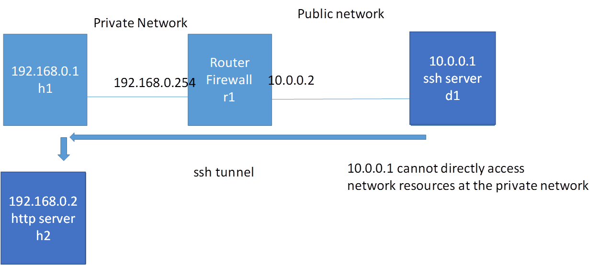
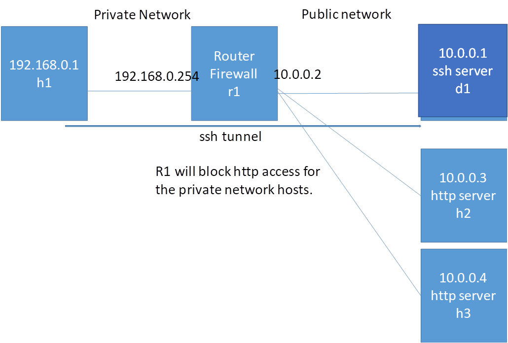
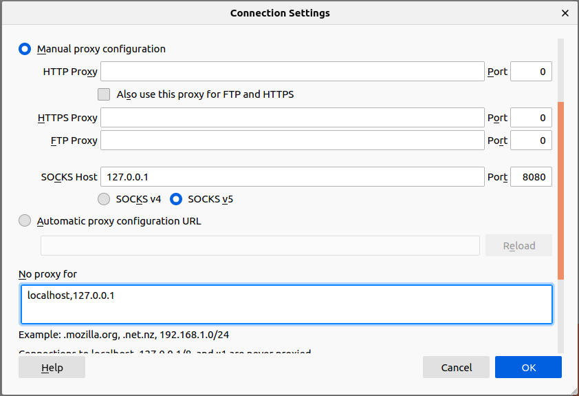
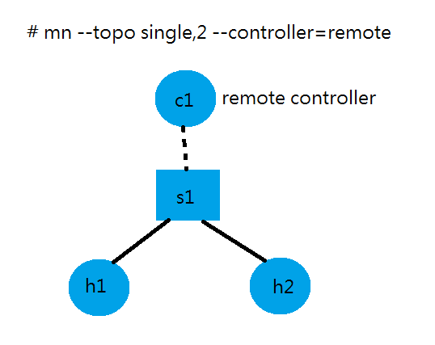
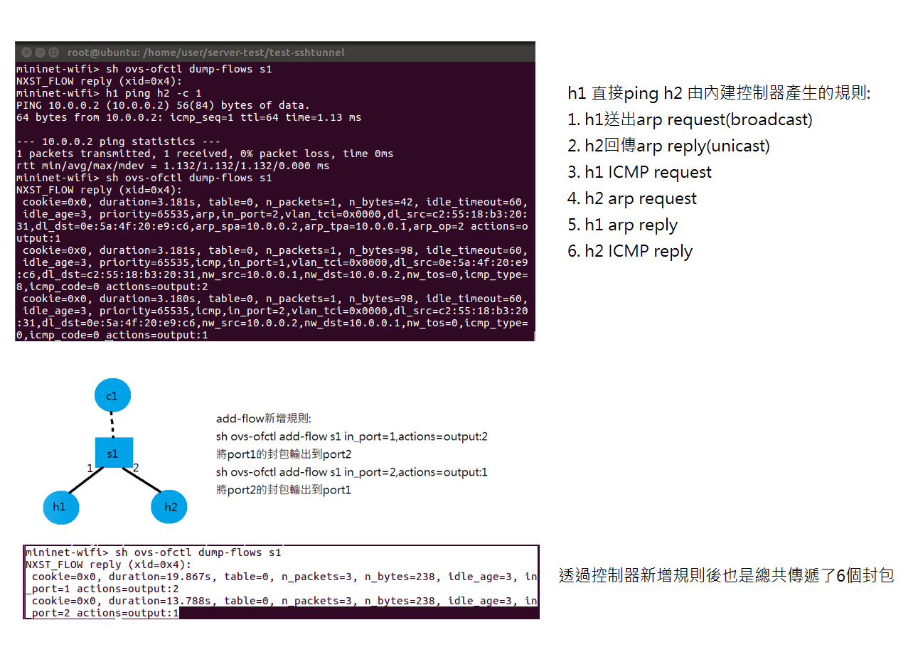

# 0502 第十二週筆記

## SSH Tunnel應用

### 範例一-連入內網的主機再透過主機連入不同IP的HTTP Server



* lab4.py
```
#!/usr/bin/python
from mininet.net import Containernet
from mininet.node import Docker
from mininet.cli import CLI
from mininet.log import setLogLevel, info
from mininet.link import TCLink, Link
 
def topology():
 
    "Create a network with some docker containers acting as hosts."
    net = Containernet()
 
    info('*** Adding hosts\n')
    h1 = net.addHost('h1', ip='192.168.0.1/24')
    h2 = net.addHost('h2', ip='192.168.0.2/24')
    br1 = net.addHost('br1')
    r1 = net.addHost('r1', ip='192.168.0.254/24')
    d1 = net.addDocker('d1', ip='10.0.0.1/24', dimage="ubuntu:2.0")
 
    info('*** Creating links\n')
    net.addLink(h1, br1)
    net.addLink(h2, br1)
    net.addLink(r1, br1)
    net.addLink(r1, d1)
   
    info('*** Starting network\n')
    net.start()
    d1.cmd("/etc/init.d/ssh start")
    r1.cmd("ifconfig r1-eth1 0")
    r1.cmd("ip addr add 10.0.0.2/24 brd + dev r1-eth1")
    r1.cmd("echo 1 > /proc/sys/net/ipv4/ip_forward")
    r1.cmd("iptables -t nat -A POSTROUTING -s 192.168.0.0/24 -o r1-eth1 -j MASQUERADE")
    h1.cmd("ip route add default via 192.168.0.254")
    br1.cmd("ifconfig br1-eth0 0")
    br1.cmd("ifconfig br1-eth1 0")
    br1.cmd("ifconfig br1-eth2 0")
    br1.cmd("brctl addbr br1")
    br1.cmd("brctl addif br1 br1-eth0")
    br1.cmd("brctl addif br1 br1-eth1")
    br1.cmd("brctl addif br1 br1-eth2")
    br1.cmd("ifconfig br1 up") 
 
    info('*** Running CLI\n')
    CLI(net)
 
    info('*** Stopping network')
    net.stop()
 
if __name__ == '__main__':
    setLogLevel('info')
    topology()
```
* 執行指令
```
# python3 lab4.py
containernet> xterm h1 h2 d1
h2> python -m SimpleHTTPServer 80
h1> ssh -Nf -R 10.0.0.1:5555:192.168.0.2:80 root@10.0.0.1
d1> curl 127.0.0.1:5555
```
### 如何在docker鏡像中安裝新的套件
* 執行指令
```
# docker run -it ubuntu:1.0
root@0ca952464060:/# apt install curl
# docker commit 0ca ubuntu:2.0
```
### 範例二-內網連接到外網的HTTP Server(Dynamic Port Forwarding)



* lab5.py
```
#!/usr/bin/python
from mininet.net import Containernet
from mininet.node import Docker
from mininet.cli import CLI
from mininet.log import setLogLevel, info
from mininet.link import TCLink, Link
 
def topology():
 
    "Create a network with some docker containers acting as hosts."
    net = Containernet()
 
    info('*** Adding hosts\n')
    h1 = net.addHost('h1', ip='192.168.0.1/24')
    r1 = net.addHost('r1', ip='192.168.0.254/24')
    d1 = net.addDocker('d1', ip='10.0.0.1/24', dimage="ubuntu:2.0")
    br1 = net.addHost('br1')
    h2 = net.addHost('h2', ip='10.0.0.3/24')
    h3 = net.addHost('h3', ip='10.0.0.4/24')
 
    info('*** Creating links\n')
    net.addLink(h1, r1)
    net.addLink(r1, br1)
    net.addLink(d1, br1)
    net.addLink(h2, br1)
    net.addLink(h3, br1)
   
    info('*** Starting network\n')
    net.start()
    d1.cmd("/etc/init.d/ssh start")
    r1.cmd("ifconfig r1-eth1 0")
    r1.cmd("ip addr add 10.0.0.2/24 brd + dev r1-eth1")
    r1.cmd("echo 1 > /proc/sys/net/ipv4/ip_forward")
    r1.cmd("iptables -t nat -A POSTROUTING -s 192.168.0.0/24 -o r1-eth1 -j MASQUERADE")
    r1.cmd("iptables -A FORWARD -s 192.168.0.1 -p tcp --dport 80 -j REJECT")
    h1.cmd("ip route add default via 192.168.0.254")
    br1.cmd("ifconfig br1-eth0 0")
    br1.cmd("ifconfig br1-eth1 0")
    br1.cmd("ifconfig br1-eth2 0")
    br1.cmd("ifconfig br1-eth3 0")
    br1.cmd("brctl addbr br1")
    br1.cmd("brctl addif br1 br1-eth0")
    br1.cmd("brctl addif br1 br1-eth1")
    br1.cmd("brctl addif br1 br1-eth2")
    br1.cmd("brctl addif br1 br1-eth3")
    br1.cmd("ifconfig br1 up") 
   
    info('*** Running CLI\n')
    CLI(net)
 
    info('*** Stopping network')
    net.stop()
 
if __name__ == '__main__':
    setLogLevel('info')
    topology()
```

* 執行指令
```
# python3 lab5.py
containernet> xterm h1 h2 h3
h2> python -m SimpleHTTPServer 80
h3> python -m SimpleHTTPServer 8080
h1> ssh -Nf -D 127.0.0.1:8080 root@10.0.0.1
h1> netstat tunlp  ##查看阜號狀態
h1> su - user
h1> firefox
≡>⚙Refrence>Network Settings>Settings...>Manual proxy configuration
```



## 軟體定義網路
### 範例一-基本設置



* 執行指令
```
# mn --topo single,2
mininet-wifi> sh ovs-ofctl dump-flows s1  ##查詢交換機內的控制表格

##直接h1 ping h2後查看規則
mininet-wifi> h1 ping h2
mininet-wifi> sh ovs-ofctl dump-flows s1

##不用內建控制器的方法1
# ps -ef | grep controller  ##找到內建控制器PID
# kill -9 7387
##不用內建控制器的方法2
# mn --topo single,2 --controller=remote

##新增規則
mininet-wifi> sh ovs-ofctl add-flow s1 in_port=1,actions=output:2
mininet-wifi> sh ovs-ofctl add-flow s1 in_port=2,actions=output:1
##刪除規則
mininet-wifi> sh ovs-ofctl del-flows s1
```



