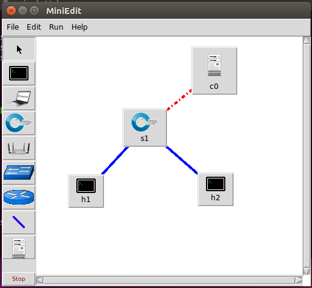

# 0509 第十三週筆記

## 軟體定義網路
### 範例一-使用pox控制器使s1成為hub



* 執行指令
```
# cd mininet-wifi/examples/
# python miniedit.py
##c0設定為remote controller
##h1 ip設為192.168.1.1/24
##h2 ip設為192.168.1.2/24
##匯出成test1.py並修改
```
* test1.py
```
#!/usr/bin/python

from mininet.net import Mininet
from mininet.node import RemoteController, OVSKernelSwitch, Host
from mininet.cli import CLI
from mininet.link import TCLink, Intf
from mininet.log import setLogLevel, info
from subprocess import call


def myNetwork():

    ##net = Mininet(topo=None, build=False, ipBase='10.0.0.0/8')
    net = Mininet()

    info( '*** Adding controller\n' )
    c0 = net.addController(name='c0',
                           controller=RemoteController,
                           ip='127.0.0.1',
                           protocol='tcp',
                           port=6633)

    info( '*** Add switches/APs\n')
    s1 = net.addSwitch('s1', cls=OVSKernelSwitch)

    info( '*** Add hosts/stations\n')
    h2 = net.addHost('h2', cls=Host, ip='192.168.1.2/24', mac='00:00:00:00:00:02', defaultRoute=None)
    h1 = net.addHost('h1', cls=Host, ip='192.168.1.1/24', mac='00:00:00:00:00:01', defaultRoute=None)

    info( '*** Add links\n')
    net.addLink(h1, s1)
    net.addLink(s1, h2)

    info( '*** Starting network\n')
    net.build()
    info( '*** Starting controllers\n')
    for controller in net.controllers:
        controller.start()

    info( '*** Starting switches/APs\n')
    net.get('s1').start([c0])

    info( '*** Post configure nodes\n')

    CLI(net)
    net.stop()


if __name__ == '__main__':
    setLogLevel( 'info' )
    myNetwork()

```

* 執行指令
```
# python test1.py
mininet> sh ovs-ofctl dump-flows s1
mininet> h1 ping h2 ##失敗
#2 cd pox
#2 ./pox.py forwarding.hub  ##透過控制器將switch變成hub
##若關閉pox仍可連線，因為規則已寫入
mininet> h1 ping h2 ##成功
```
* 遠端控制器種類(皆使用openflow通訊協定)

controller | 使用語言
-----------|--------
pox | python
ryu | python
floodlight | java
onos | java
nox| C

### 範例二-手動寫入規則
* 執行指令
```
# python test1.py
mininet> sh ovs-ofctl show s1  ##查看詳細資訊

```


capabilities | 能力
-----------|--------
FLOW_STATS | 規則統計
TABLE_STATS | 
PORT_STATS | 埠號統計
QUEUE_STATS | 
ARP_MATCH_IP | 

actions | 動作
-----------|--------
enqueue | 佇列
set_vlan_vid、set_vlan_pcp、strip_vlan | 加入移除vlan標籤
mod_dl_src | 修改data link source

