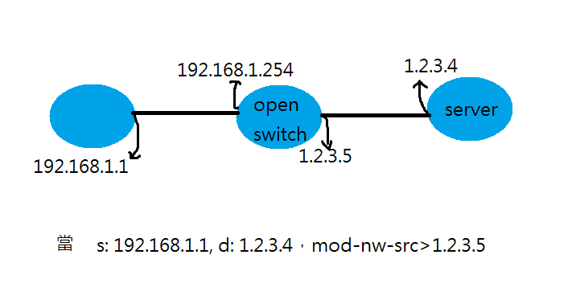
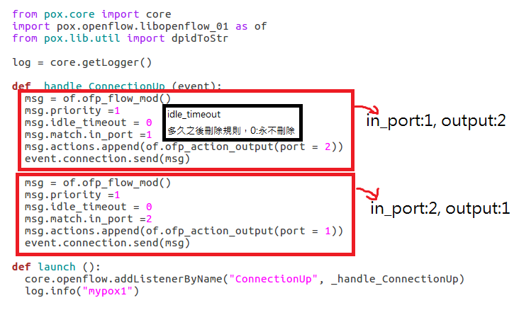
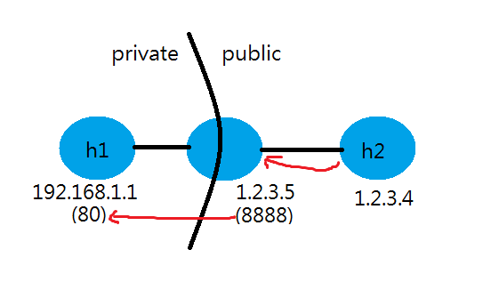

# 0516 第十四週筆記

## NAT實作
### 範例一



* 2.py
```
#!/usr/bin/python

from mininet.net import Mininet
from mininet.node import RemoteController, OVSKernelSwitch, Host
from mininet.cli import CLI
from mininet.link import TCLink, Intf
from mininet.log import setLogLevel, info
from subprocess import call


def myNetwork():

    net = Mininet()

    info( '*** Adding controller\n' )
    c0 = net.addController(name='c0',
                           controller=RemoteController,
                           ip='127.0.0.1',
                           protocol='tcp',
                           port=6633)

    info( '*** Add switches/APs\n')
    s1 = net.addSwitch('s1', cls=OVSKernelSwitch)

    info( '*** Add hosts/stations\n')
    h1 = net.addHost('h1', cls=Host, ip='192.168.1.1/24', mac='00:00:00:00:00:01', defaultRoute=None)
    h2 = net.addHost('h2', cls=Host, ip='1.2.3.4/24', mac='00:00:00:00:00:02', defaultRoute=None)

    info( '*** Add links\n')
    net.addLink(h1, s1)
    net.addLink(h2, s1)

    info( '*** Starting network\n')
    net.build()
    info( '*** Starting controllers\n')
    for controller in net.controllers:
        controller.start()

    info( '*** Starting switches/APs\n')
    net.get('s1').start([c0])
    net.get('h1').cmd("arp -s 192.168.1.254 00:00:00:01:02:03")
    net.get('h1').cmd("ip route add default via 192.168.1.254")
    net.get('h2').cmd("arp -s 1.2.3.5 00:00:00:03:02:01")

    info( '*** Post configure nodes\n')

    CLI(net)
    net.stop()


if __name__ == '__main__':
    setLogLevel( 'info' )
    myNetwork()
```

* 執行指令
```
# python 2.py
mininet> sh ovs-ofctl add-flow s1 ip,nw_src=192.168.1.1,nw_dst=1.2.3.4,actions=mod_nw_src=1.2.3.5,mod_dl_dst=00:00:00:00:00:02,output:2
mininet> sh ovs-ofctl add-flow s1 ip,nw_src=1.2.3.4,nw_dst=1.2.3.5,actions=mod_nw_dst=192.168.1.1,mod_dl_dst=00:00:00:00:00:01,output:1

```

## SDN

### 範例一-將規則寫在控制器中(pox)
* 3.py
```
#!/usr/bin/python

from mininet.net import Mininet
from mininet.node import RemoteController, OVSKernelSwitch, Host
from mininet.cli import CLI
from mininet.link import TCLink, Intf
from mininet.log import setLogLevel, info
from subprocess import call


def myNetwork():

    net = Mininet(topo=None,
                       build=False,
                       ipBase='10.0.0.0/8')

    info( '*** Adding controller\n' )
    c0 = net.addController(name='c0',
                           controller=RemoteController,
                           ip='127.0.0.1',
                           protocol='tcp',
                           port=6633)

    info( '*** Add switches/APs\n')
    s1 = net.addSwitch('s1', cls=OVSKernelSwitch)

    info( '*** Add hosts/stations\n')
    h2 = net.addHost('h2', cls=Host, ip='10.0.0.2', defaultRoute=None)
    h1 = net.addHost('h1', cls=Host, ip='10.0.0.1', defaultRoute=None)

    info( '*** Add links\n')
    net.addLink(h1, s1)
    net.addLink(h2, s1)

    info( '*** Starting network\n')
    net.build()
    info( '*** Starting controllers\n')
    for controller in net.controllers:
        controller.start()

    info( '*** Starting switches/APs\n')
    net.get('s1').start([c0])

    info( '*** Post configure nodes\n')

    CLI(net)
    net.stop()


if __name__ == '__main__':
    setLogLevel( 'info' )
    myNetwork()

```

* test.py(home/user/pox/pox/test.py)
```
from pox.core import core
import pox.openflow.libopenflow_01 as of
from pox.lib.util import dpidToStr
 
log = core.getLogger()
 
def _handle_ConnectionUp (event):
  msg = of.ofp_flow_mod()
  msg.priority =1
  msg.idle_timeout = 0
  msg.match.in_port =1
  msg.actions.append(of.ofp_action_output(port = 2))
  event.connection.send(msg)
 
  msg = of.ofp_flow_mod()
  msg.priority =1
  msg.idle_timeout = 0
  msg.match.in_port =2
  msg.actions.append(of.ofp_action_output(port = 1))
  event.connection.send(msg)
 
def launch ():
  core.openflow.addListenerByName("ConnectionUp", _handle_ConnectionUp)
  log.info("mypox1")
```



* 執行指令
```
# python 3.py
#2 cd pox/pox
#2 ./pox.py test
mininet> h1 ping h2
```

### 範例二-port forwarding(DNAT)



* 執行指令
```
# python 2.py
mininet> xterm h1 h2
h1> python -m SimpleHTTPServer 80
mininet> sh ovs-ofctl add-flow s1 tcp,nw_src=1.2.3.4,nw_dst=1.2.3.5,tp_dst=8888,action=mod_nw_dst=192.168.1.1,mod_dl_dst=00:00:00:00:00:01,mod_tp_dst:80,output:1
mininet> sh ovs-ofctl add-flow s1 tcp,nw_src=192.168.1.1,nw_dst=1.2.3.4,tp_src=80,action=mod_nw_src:1.2.3.5,mod_dl_dst=00:00:00:00:00:02,mod_tp_src:8888,output:2
h2> curl 1.2.3.5:8888
```
### 範例三-防火牆firewall
目的:h1可以與h2互ping，也可以連接到h2:80，但不能與h2:8080通訊。

* 執行指令
```
# python 2.py
mininet> xterm h1
mininet> sh ovs-ofctl add-flow s1 priority=10,ip,nw_src=192.168.1.1,nw_dst=1.2.3.4,action=mod_nw_src=1.2.3.5,mod_dl_dst=00:00:00:00:00:02,output:2
mininet> sh ovs-ofctl add-flow s1 priority=10,ip,nw_src=1.2.3.4,nw_dst=1.2.3.5,action=mod_nw_dst=192.168.1.1,mod_dl_dst=00:00:00:00:00:01,output:1
mininet> sh ovs-ofctl add-flow s1 priority=100,tcp,nw_src=192.169.1.1,nw_dst=1.2.3.4,tp_dst=80,action=mod_nw_src=1.2.3.5,mod_dl_dst=00:00:00:00:00:02,output:2
mininet> sh ovs-ofctl add-flow s1 priority=100,tcp,nw_src=1.2.3.4,nw_dst=1.2.3.5,tp_src=80,action=mod_nw_dst=192.168.1.1,mod_dl_dst=00:00:00:00:00:01,output:1
mininet> sh ovs-ofctl add-flow s1 priority=100,tcp,nw_src=192.169.1.1,nw_dst=1.2.3.4,tp_dst=8080,action=DROP
h2> python -m SimpleHTTPServer 80
h2> python -m SimpleHTTPServer 8080
h1> curl 1.2.3.4:80  ##成功
h1> curl 1.2.3.4:8080  ##失敗

```
