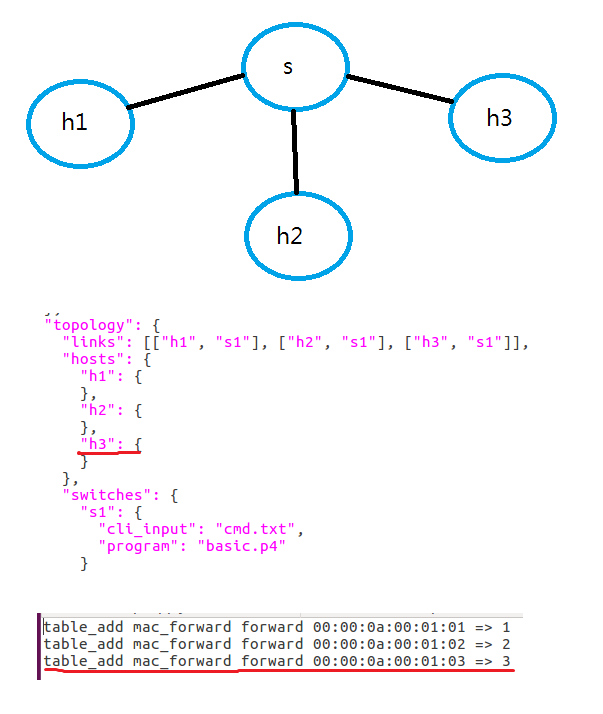

# 0606 第十七週筆記
## linix基本概念
### bash與child process


### zombie process

* life_period.c
讓child process結束時不被回收，child process>zombie process
```
#include <stdio.h>
#include <sys/wait.h>
#include <stdlib.h>
#include <unistd.h>

int main(void)
{
        pid_t pid,wait_pid;
        int status;

        pid = fork();

        if (pid==-1)    {
                perror("Cannot create new process");
                exit(1);
        } else  if (pid==0) {
                printf("child process id: %ld\n", (long) getpid());
                //pause();
                _exit(0);
        } else {
#if 1 /* define 1 to make child process always a zomie */
                printf("ppid:%d\n", getpid());
                while(1);
#endif
                do {
                        wait_pid=waitpid(pid, &status, WUNTRACED | WCONTINUED);

                        if (wait_pid == -1) {
                                perror("cannot using waitpid function");
                                exit(1);
                        }

                        if (WIFEXITED(status))
                                printf("child process exites, status=%d\n", WEXITSTATUS(status));

                        if(WIFSIGNALED(status))
                                printf("child process is killed by signal %d\n", WTERMSIG(status));

                        if (WIFSTOPPED(status))
                                printf("child process is stopped by signal %d\n", WSTOPSIG(status));

                        if (WIFCONTINUED(status))
                                printf("child process resume running....\n");

                } while (!WIFEXITED(status) && !WIFSIGNALED(status));

                exit(0);
        }
}
```

* 執行指令
```
# gcc -o life_period life_period.c
# ./life_period
#2 ps -aux  ##查看執行中程序

##若要解決zombie process
# kill -9 [PID]
```


### orphan proess
* life_period.c(加入pause涵式)
```
#include <stdio.h>
#include <sys/wait.h>
#include <stdlib.h>
#include <unistd.h>

int main(void)
{
        pid_t pid,wait_pid;
        int status;

        pid = fork();

        if (pid==-1)    {
                perror("Cannot create new process");
                exit(1);
        } else  if (pid==0) {
                printf("child process id: %ld\n", (long) getpid());
                pause();
                _exit(0);
        } else {
#if 1 /* define 1 to make child process always a zomie */
                printf("ppid:%d\n", getpid());
                while(1);
#endif
                do {
                        wait_pid=waitpid(pid, &status, WUNTRACED | WCONTINUED);

                        if (wait_pid == -1) {
                                perror("cannot using waitpid function");
                                exit(1);
                        }

                        if (WIFEXITED(status))
                                printf("child process exites, status=%d\n", WEXITSTATUS(status));

                        if(WIFSIGNALED(status))
                                printf("child process is killed by signal %d\n", WTERMSIG(status));

                        if (WIFSTOPPED(status))
                                printf("child process is stopped by signal %d\n", WSTOPSIG(status));

                        if (WIFCONTINUED(status))
                                printf("child process resume running....\n");

                } while (!WIFEXITED(status) && !WIFSIGNALED(status));

                exit(0);
        }
}
```

*  執行指令
```
# gcc -o life_period life_period.c
# ./life_period
#2 pstree -p
#2 kill -9 3400  ##parent process
#2 pstree -p  ##子行程的位置將由上一個parent process接管
```

### 基本指令
```
# [a command] ; [b command]  ##a執行成功與否都執行b
# [a command] && [b command]  ##a成功，b才會執行
# [a command] && [b command] || [c command]  ##a成功執行b，a失敗執行c
```


## ps switch

### 範例一-h1 h2 h3互ping



* 執行指令
```
# cd /home/user/p4-test/2-a
# p4run
mininet> h1 ping h3 -c 3  ##成功
mininet> h2 ping h3 -c 3  ##成功
mininet> h1 ping h2 -c 3  ##成功

##查看背後的歷程記錄
# cd log
# cat s1.log
```

### 範例二-透過第三層(IP)進行連線


* 執行指令
```
# cd /home/user/p4-test/3
# p4run

```

* 表頭對應


### 範例三-將p4交換機做成一台NAT伺服器


* ip_forward.p4
```
#include <core.p4>
#include <v1model.p4>
typedef bit<48> macAddr_t;
typedef bit<9> egressSpec_t;
  
header ethernet_t {
    bit<48> dstAddr;
    bit<48> srcAddr;
    bit<16> etherType;
}
 
header ipv4_t {
    bit<4>  version;
    bit<4>  ihl;
    bit<8>  diffserv;
    bit<16> totalLen;
    bit<16> identification;
    bit<3>  flags;
    bit<13> fragOffset;
    bit<8>  ttl;
    bit<8>  protocol;
    bit<16> hdrChecksum;
    bit<32> srcAddr;
    bit<32> dstAddr;
}
 
struct metadata {
}
 
struct headers {
    @name(".ethernet")
    ethernet_t ethernet;
    @name(".ipv4")
    ipv4_t     ipv4;
}
 
parser ParserImpl(packet_in packet, out headers hdr, inout metadata meta, inout standard_metadata_t standard_metadata) {

    @name(".parse_ethernet") state parse_ethernet {
        packet.extract(hdr.ethernet);
        transition select(hdr.ethernet.etherType) {
            16w0x800: parse_ipv4;
            default: accept;
        }
    }
    @name(".parse_ipv4") state parse_ipv4 {
        packet.extract(hdr.ipv4);
        transition accept;
    }
    @name(".start") state start {
        transition parse_ethernet;
    }
}
 
control egress(inout headers hdr, inout metadata meta, inout standard_metadata_t standard_metadata) {
    apply {
    }
}
 
control ingress(inout headers hdr, inout metadata meta, inout standard_metadata_t standard_metadata) {

    action set2h1(macAddr_t dstAddr, egressSpec_t port, bit<32> ip) {
       hdr.ethernet.srcAddr = hdr.ethernet.dstAddr;
       hdr.ethernet.dstAddr = dstAddr;
       standard_metadata.egress_spec = port;
       hdr.ipv4.dstAddr = ip;
       hdr.ipv4.ttl = hdr.ipv4.ttl - 1; 
    }

    @name(".set_nhop") action set_nhop(macAddr_t dstAddr, egressSpec_t port, bit<32> ip) {
        //set the src mac address as the previous dst, this is not correct right?
        hdr.ethernet.srcAddr = hdr.ethernet.dstAddr;
 
        //set the destination mac address that we got from the match in the table
        hdr.ethernet.dstAddr = dstAddr;
 
        //set the output port that we also get from the table
        standard_metadata.egress_spec = port;

        hdr.ipv4.srcAddr = ip;
 
        //decrease ttl by 1
        hdr.ipv4.ttl = hdr.ipv4.ttl - 1;
    }
    @name("._drop") action _drop() {
        mark_to_drop(standard_metadata);
    }
    @name(".ipv4_lpm") table ipv4_lpm {
        actions = {
            set_nhop;
            set2h1;
            _drop;
        }
        key = {
            hdr.ipv4.dstAddr: lpm;
        }
        size = 512;
        const default_action = _drop();
    }
    apply {
        ipv4_lpm.apply();
    }
}
 
control DeparserImpl(packet_out packet, in headers hdr) {
    apply {
        packet.emit(hdr.ethernet);
        packet.emit(hdr.ipv4);
    }
}
 
control verifyChecksum(inout headers hdr, inout metadata meta) {
    apply {
        verify_checksum(true, { hdr.ipv4.version, hdr.ipv4.ihl, hdr.ipv4.diffserv, hdr.ipv4.totalLen, hdr.ipv4.identification, hdr.ipv4.flags, hdr.ipv4.fragOffset, hdr.ipv4.ttl, hdr.ipv4.protocol, hdr.ipv4.srcAddr, hdr.ipv4.dstAddr }, hdr.ipv4.hdrChecksum, HashAlgorithm.csum16);
    }
}
 
control computeChecksum(inout headers hdr, inout metadata meta) {
    apply {
        update_checksum(true, { hdr.ipv4.version, hdr.ipv4.ihl, hdr.ipv4.diffserv, hdr.ipv4.totalLen, hdr.ipv4.identification, hdr.ipv4.flags, hdr.ipv4.fragOffset, hdr.ipv4.ttl, hdr.ipv4.protocol, hdr.ipv4.srcAddr, hdr.ipv4.dstAddr }, hdr.ipv4.hdrChecksum, HashAlgorithm.csum16);
    }
}
 
V1Switch(ParserImpl(), verifyChecksum(), ingress(), egress(), computeChecksum(), DeparserImpl()) main;

```
* p4app.json
```
{
  "program": "ip_forward.p4",
  "switch": "simple_switch",
  "compiler": "p4c",
  "options": "--target bmv2 --arch v1model --std p4-16",
  "switch_cli": "simple_switch_CLI",
  "cli": true,
  "pcap_dump": true,
  "enable_log": true,
  "topo_module": {
    "file_path": "",
    "module_name": "p4utils.mininetlib.apptopo",
    "object_name": "AppTopoStrategies"
  },
  "controller_module": null,
  "topodb_module": {
    "file_path": "",
    "module_name": "p4utils.utils.topology",
    "object_name": "Topology"
  },
  "mininet_module": {
    "file_path": "",
    "module_name": "p4utils.mininetlib.p4net",
    "object_name": "P4Mininet"
  },
  "topology": {
    "assignment_strategy": "manual",
    "auto_arp_tables": "true",
    "auto_gw_arp": "true",
    "links": [["h1", "s1"], ["h2", "s1"]],
    "hosts": {
      "h1": {
        "ip": "10.0.1.1/24",
        "gw": "10.0.1.254"
      },
      "h2": {
        "ip": "10.0.2.1/24",
       "gw": "10.0.2.254"
      }
    },
    "switches": {
      "s1": {
        "cli_input": "cmd.txt",
        "program": "ip_forward.p4"
      }
    }
  }
}

```
* cmd.txt
```
table_add ipv4_lpm set_nhop 10.0.2.1/32 => 00:00:0a:00:02:01 2 10.0.2.254
table_add ipv4_lpm set2h1 10.0.2.254/32 => 00:00:0a:00:01:01 1 10.0.1.1

```